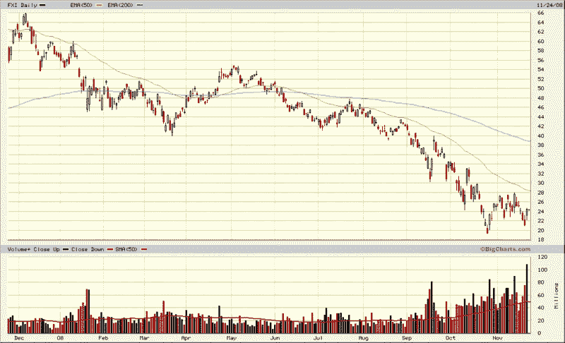

<!--yml

category: 未分类

date: 2024-05-18 18:14:33

-->

# VIX and More: 是时候做多中国了吗？

> 来源：[`vixandmore.blogspot.com/2008/11/time-to-be-long-china.html#0001-01-01`](http://vixandmore.blogspot.com/2008/11/time-to-be-long-china.html#0001-01-01)

回到 2007 年 10 月 10 日的帖子，标题为[何时做空中国？](http://vixandmore.blogspot.com/2007/10/when-to-short-china.html)，我预测：

> **最终，总会有一个时刻，你回过头来对自己说，“我为什么没有做空中国？这真是太明显了…”**

自那篇帖子发布以来的 13 ½个月内，iShares FTSE/Xinhua China 25 Index ([FXI](http://vixandmore.blogspot.com/search/label/FXI)) 从调整后的 63 跌至 24 余，跌幅约为 62%。

预测市场顶部和底部总是危险的游戏，但投资者应始终警惕潜在的重要顶部和底部。

回到[中国](http://vixandmore.blogspot.com/search/label/China)，请注意下图，FXI 上周的低点比 10 月的低点高出约 5%，周五的反弹伴随着创纪录的成交量。我可能要等到 FXI 收盘价超过 28 左右，才会确认其反弹，但 FXI 显示的底部迹象比美国股市的其他许多领域更令人鼓舞。

关于中国 5860 亿美元的刺激计划中，有多少是新开支，有多少是已经承诺的项目，但被重新标记以适应刺激计划伞下的项目，对此存在很大分歧。关于中国经济放缓的程度，也有广泛的观点，当前的估计显示，经济增长最高可达 7%，而中国经济可能正在萎缩。随着这些问题进一步明朗化，预计 FXI 将大幅波动。然而，如果 10 月 27 日低点 19.35 最终被证明是底部，也请不要感到惊讶。

**来源：BigCharts**
