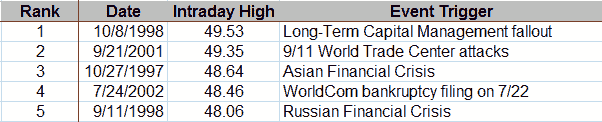

<!--yml

分类：未分类

日期：2024-05-18 18:24:37

-->

# VIX and More: Top Five VIX Spikes

> 来源：[`vixandmore.blogspot.com/2008/09/top-five-vix-spikes.html#0001-01-01`](http://vixandmore.blogspot.com/2008/09/top-five-vix-spikes.html#0001-01-01)

随着[VIX](http://vixandmore.blogspot.com/search/label/VIX%20spikes)刚刚飙升到 39.59，我想回顾一下自 1990 年以来的前五次 VIX 读数可能会有所启发，这是 CBOE 首次计算 VIX 历史数据的年份：

请注意，这些读数都被[VXO](http://vixandmore.blogspot.com/search/label/VXO)（“旧 VIX”）在[黑色星期一](http://vixandmore.blogspot.com/search/label/Black%20Monday) [1987](http://vixandmore.blogspot.com/search/label/1987)上记录的[超过 170](http://vixandmore.blogspot.com/2008/03/volatility-history-lesson-1987.html)的高值所淹没。
