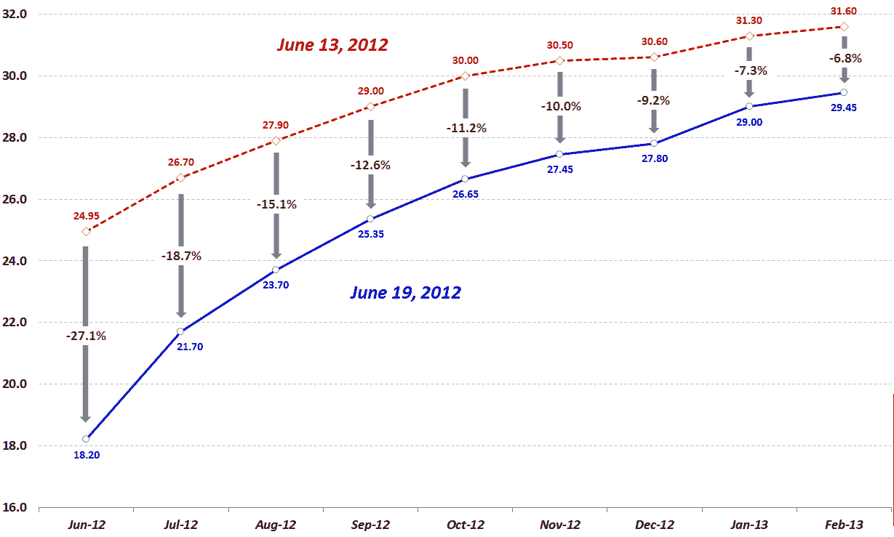

<!--yml

类别：未分类

日期：2024-05-18 16:27:47

-->

# VIX 和 More: 跟踪 VIX 期货的下跌

> 来源：[`vixandmore.blogspot.com/2012/06/tracking-fall-in-vix-futures.html#0001-01-01`](http://vixandmore.blogspot.com/2012/06/tracking-fall-in-vix-futures.html#0001-01-01)

过去的四天里，与 VIX 有关的一切都出现了急剧下跌。现金/现货 VIX 从我写这篇文章的时候起下跌了 26%从上周三的收盘价，[VIX 期货](http://vixandmore.blogspot.com/search/label/VIX%20futures)也跟随 VIX 不同程度的下跌。下面的图表显示了过去四天所有 VIX 合约的变化——在这段时间内，整个 VIX 期货[期限结构](http://vixandmore.blogspot.com/search/label/term%20structure)急剧下跌。

像往常一样，前端合约（六月）的下跌是最剧烈的，实际上在同一时期超过了现金/现货 VIX 的下跌。由于六月合约将于明天开盘时到期，所以最近几天合约的波动性像 VIX 指数一样激烈也就不足为奇了。请注意，在期限结构的另一端，明年二月（2013 年）的 VIX 期货合约下跌了仅 6.8%，约为前端期货合约下跌的四分之一。考虑到我们在当前到期周期中所处的位置（在最后），其他月份相对于前端 VIX 期货的变化符合历史常态。

细心的读者无疑会注意到十二月份合约在下跌中出现了[假期效应](http://vixandmore.blogspot.com/search/label/Holiday%20Effect)的证据，其中交易天数减少和看涨[季节性](http://vixandmore.blogspot.com/search/label/seasonality)因素往往抑制波动性——以及波动性预期。*[这让人不禁思考欧洲主权债务危机和美国财政悬崖是否也会在今年假期期间休假，但这将是另一个帖子的话题…]*

底线是即使 VIX 在 18.00 点附近徘徊，投资者仍然预期 2013 年初的 VIX 会在 29-30 点范围内。虽然这对一些人来说可能很高，但它低于上周还预期 VIX 会在 31-32 点。*

有一点我敢肯定：在未来几个季度里，仅仅观察金融市场的波动就会带来相当大的娱乐价值。还有一点我几乎可以肯定：当 VIX 期货出现大幅波动时，新的机会一定会出现。

相关文章：

**

来源：CBOE，Interactive Brokers*

***披露(s):*** *CBOE 是 VIX 和 More 的广告商*
