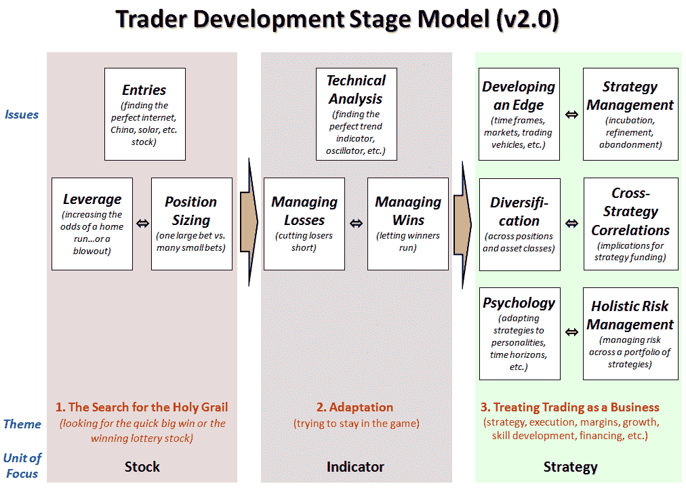

<!--yml

分类：未分类

日期：2024-05-18 17:27:30

-->

# VIX 和更多：交易者发展阶段模型 - 版本 2.0

> 来源：[`vixandmore.blogspot.com/2009/10/trader-stage-development-model-version.html#0001-01-01`](http://vixandmore.blogspot.com/2009/10/trader-stage-development-model-version.html#0001-01-01)

我很高兴看到对我的草案[交易者发展阶段模型](http://vixandmore.blogspot.com/search/label/trader%20development%20stage%20model)的积极回应，我上周二在一篇标题不太可能的帖子[草案交易者发展阶段模型](http://vixandmore.blogspot.com/2009/09/draft-trader-stage-development-model.html)中推出了这个模型，并立即在[交易者发展阶段模型与从股票到期权的跳跃](http://vixandmore.blogspot.com/2009/09/trader-stage-development-model-and-jump.html)一文中在一个期权背景下投入使用。显然这个框架与许多交易者产生了共鸣，从初学者到高级交易者。

由于我不擅长知道何时放手，我认为扩展原始交易者发展阶段的简化版本并介绍第二个版本可能会有所帮助。

下面的图表只在原始阶段发展模型的基础上增加了两个新框(*技术分析*和*策略管理*)，但也增加了一些解释性注释，为了阐明而添加的标签(*问题*、*主题*和*关注单元*)，并进一步将每个三个阶段与我所称的*关注单元*相关联，但也可以解释为抽象级别或类似的东西。

正如上次一样，我不会再花太多时间添加解释性评论，只是指出双向箭头表示紧密相关问题之间的紧张关系，有时是因为它们相互竞争，有时是因为它们是互补的。此外，虽然上次我没有明确指出，背景颜色旨在表示交易者可能亏损、盈亏平衡以及最终盈利的情况。

有潜力将这个交易者发展模型进一步具体化，用它作为诊断工具等。目前，这个模型目前的详细程度对我预见的大部分应用来说可能是合适的。

由于这是一个高度主观的心理模型，我很乐意接受任何反馈、批评、建议改进等。

关于交易者发展模型的更多信息，建议读者查阅：

