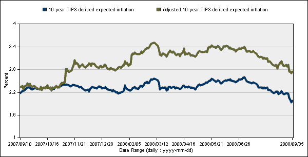

<!--yml

类别：未分类

date: 2024-05-18 18:27:36

-->

# VIX 和更多：国债通胀保护证券和通胀预期

> 来源：[`vixandmore.blogspot.com/2008/09/treasury-inflation-protected-securities.html#0001-01-01`](http://vixandmore.blogspot.com/2008/09/treasury-inflation-protected-securities.html#0001-01-01)

首先出现了通货膨胀的恐慌，随后是通货紧缩的恐慌，现在看来任何网络或博客都能找到足够多的经济学家来支持这两种情景中的任何一种作为经济的一大严重担忧。

在混乱时期，我喜欢从市场寻找线索。这次我要说的是可以从国债通胀保护证券（俗称[TIPS](http://vixandmore.blogspot.com/search/label/TIPS)）中获得的未来通胀率预期。使用消费者价格指数（CPI）作为通胀基准，TIPS 的票息支付和本金会自动调整以反映通胀。通过对流动性溢价和通胀风险溢价进行一些假设的缓解，可以从名义国债和 TIPS 之间的收益率差异中得出通胀预期的市场评估，下面图表正是显示了这一点。

根据 TIPS 收益率差异分析，通胀预期似乎在 2 月底或 6 月底达到顶峰，并且在过去两个月里一直在稳步下降，以至于当前的通胀预期水平已经达到至少十个月来未见过的水平。

 [来源：克利夫兰联邦储备银行]
