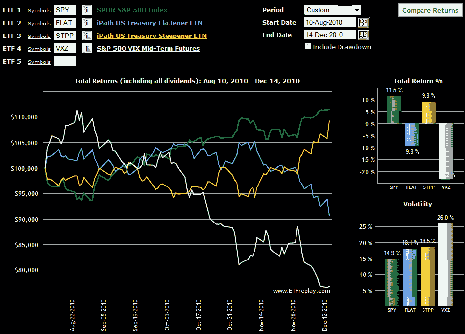

<!--yml

分类：未分类

日期：2024-05-18 16:56:29

-->

# VIX 和更多：国债收益率曲线 ETNs 和波动性

> 来源：[`vixandmore.blogspot.com/2010/12/treasury-yield-curve-etfs-and.html#0001-01-01`](http://vixandmore.blogspot.com/2010/12/treasury-yield-curve-etfs-and.html#0001-01-01)

VIX 和国债收益率的主题是我在这个问题上可能没有在此空间中详细探讨过的，所以随着一些最近的发展，这似乎是一个很好的时间深入研究该主题。

我兴趣浓厚的其中一个重要原因是最近国债[收益率曲线](http://vixandmore.blogspot.com/search/label/yield%20curve)的快速陡峭化。另一个原因是 Morningstar 的 Timothy Strauts 的一篇优秀文章，讨论了两种收益率曲线 ETN 策略：[如何利用陡峭的收益率曲线](http://advisor.morningstar.com/articles/fcarticle.asp?docId=20710&sPage=1)。在这篇文章中，Strauts 讨论了 iPath 推出的两种旨在利用变得更陡峭或平坦的收益率曲线的 ETN。这些 ETN 正式名称为 iPath 美国国债陡峭器 ETN([STPP](http://vixandmore.blogspot.com/search/label/STPP))和 iPath 美国国债平坦器 ETN([FLAT](http://vixandmore.blogspot.com/search/label/FLAT))。这些创新且令人兴奋的 ETN 持有 2 年和 10 年国债期货，并每月重新平衡。在许多方面，它们代表了我所说的[策略盒式 ETP](http://vixandmore.blogspot.com/search/label/Strategy-in-a-Box%20ETFs)的最新一代。

8 月份推出的 STPP 和 FLAT 在过去几周开始吸引了一些关注，因为国债收益率变得更加波动。

目前还没有太多的业绩记录，但我将感兴趣观察 STPP 和 FLAT 的变动如何与 VIX 的变动相互作用。首先，我选择同时观察 STPP 和 FLAT 以及 SPY 和[VXZ](http://vixandmore.blogspot.com/search/label/VXZ)（注意我这里选择 VXZ 是为了避开最近[VIX 期货](http://vixandmore.blogspot.com/search/label/VIX%20futures) [期限结构](http://vixandmore.blogspot.com/search/label/term%20structure)中的强烈[正向市场](http://vixandmore.blogspot.com/search/label/contango)，这加剧了[VXX](http://vixandmore.blogspot.com/search/label/VXX)的价格下跌。）

下面的图表显示了自 8 月 10 日以来收益率曲线 ETN 的表现。注意到目前为止——特别是最近——FLAT 与 VXZ 衡量出的隐含波动率预期的变化更为正相关。另一方面，STPP 显示出与股票更高的正相关性，至少从 SPY 来看是这样。

今后，我将定期更新关于 VIX 和国债收益率曲线变化之间的观察结果，并讨论国债收益率曲线可能如何预测 VIX 的未来。

相关文章：

*[来源：ETFreplay.com]*

**披露声明：** *在撰写本文时做空 VXX*
