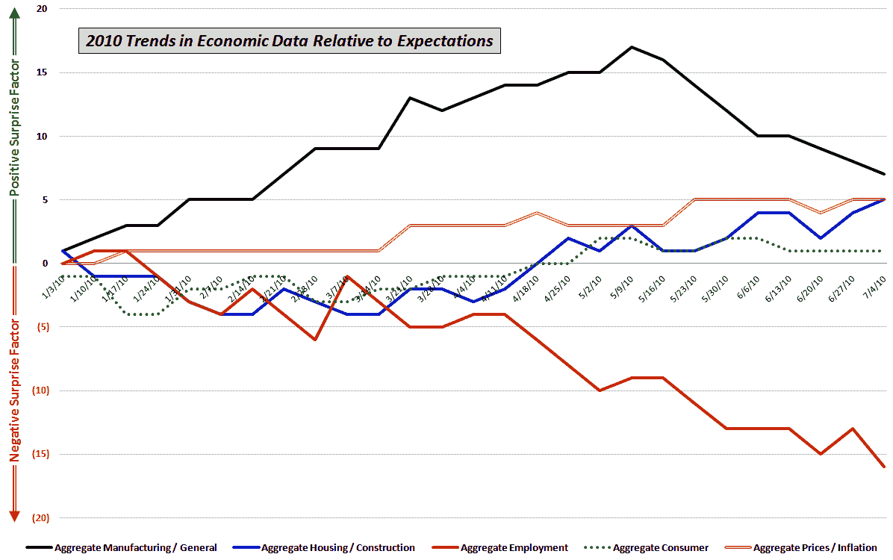

<!--yml

类别：未分类

日期：2024-05-18 17:06:54

-->

# VIX 和更多：相对于预期的经济数据趋势

> 来源：[`vixandmore.blogspot.com/2010/07/trends-in-economic-data-relative-to.html#0001-01-01`](http://vixandmore.blogspot.com/2010/07/trends-in-economic-data-relative-to.html#0001-01-01)

在长周末之前，我认为我会发布一张我使用的图表，其中我跟踪了关键经济数据发布相对于市场普遍预期的表现。

数据被分为五组，包括以下突出显示的经济报告：

+   *制造业/综合* – 国内生产总值(GDP), 工业生产指数, 产能利用率, 耐用品订单, 工厂订单, 地区联邦指数, 生产力等。

+   *[房地产](http://vixandmore.blogspot.com/search/label/housing)/建筑* – 建筑许可证，房屋开工，现有房屋销售，新房销售，待售新房销售，标普/凯斯-夏皮尔房价指数，建筑支出等。

+   *[就业](http://vixandmore.blogspot.com/search/label/nonfarm%20payrolls)* – 就业报告，失业救济申请等。

+   *消费者* – 零售销售，消费者信心，消费者情绪，个人收入，个人消费支出等。

+   *价格/通货膨胀* – 生产者价格指数, 消费者价格指数等。

对于每个报告，我评估数据是否超过了或低于市场普遍预期。然后我将这些数据随时间汇总，以观察经济的某些部分是相对于预期趋势上升还是下降。

下面的图表总结了自年初以来这五个类别的趋势。在相对于预期的表现方面，制造业（实心黑线）表现最好，尽管近两个月趋势有所下降。毫不奇怪，表现最差的领域——明显地——是就业（实心红线），从 4 月中旬以来，相对于预期的趋势一直呈负面。

关于相关主题，读者们可以查阅以下内容：

***披露(s):*** *无*
