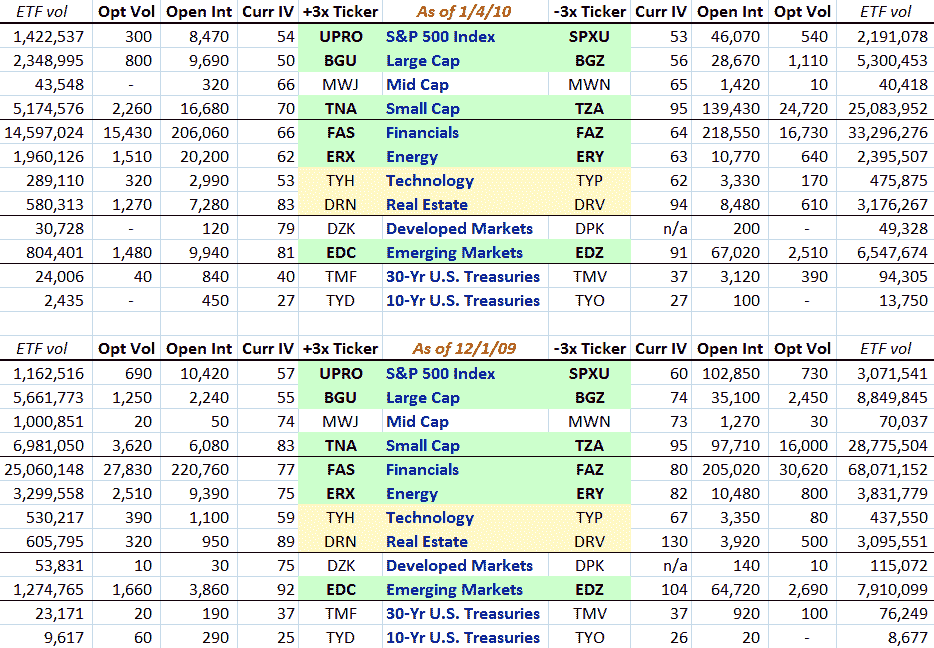

<!--yml

类别：未分类

日期：2024-05-18 17:18:09

-->

# VIX 和更多：新保证金规则实施一个月后的三倍 ETF 期权格局

> 来源：[`vixandmore.blogspot.com/2010/01/triple-etf-options-landscape-one-month.html#0001-01-01`](http://vixandmore.blogspot.com/2010/01/triple-etf-options-landscape-one-month.html#0001-01-01)

2009 年 12 月 1 日，金融行业监管机构（FINRA）在[提高杠杆交换交易基金及其相关未覆盖期权的保证金要求](http://www.finra.org/web/groups/industry/@ip/@reg/@notice/documents/notices/p119906.pdf)方面实施了更严格的保证金要求。

在那天，我更新了我所有可期权三倍 ETF 的表格，并且由于一个月已经过去，我认为这些 ETF 及其期权的活动可能受到了新保证金要求的影响，所以我想看看这些数据。

使用 iVolatility.com 的数据，我下面捕捉到了一些亮点。虽然这里没有展示，但我应该指出，从我的[上一个更新](http://vixandmore.blogspot.com/2009/09/updating-triple-etf-options-landscape.html)（2009 年 9 月 9 日）到 12 月 1 日，四对不同的三倍 ETF 对（[UPRO](http://vixandmore.blogspot.com/search/label/UPRO)/[SPXU](http://vixandmore.blogspot.com/search/label/SPXU)，[TNA](http://vixandmore.blogspot.com/search/label/TNA)/[TZA](http://vixandmore.blogspot.com/search/label/TZA)，[DRN](http://vixandmore.blogspot.com/search/label/DRN)/[DRV](http://vixandmore.blogspot.com/search/label/DRV)和[EDC](http://vixandmore.blogspot.com/search/label/EDC)/[EDZ](http://vixandmore.blogspot.com/search/label/EDZ))在成交量上显示出大幅增长，每一对都显示出某种兴趣增加的迹象 -- 所以在新的保证金规则实施时，三倍 ETF 有 significant momentum。然而，这次唯一显著的增长出现在长期债券对[TMF](http://vixandmore.blogspot.com/search/label/TMF)和[TMV](http://vixandmore.blogspot.com/search/label/TMV)，这确实是从一个非常小的基数开始的。此外，有迹象表明，大型股对([BGU](http://vixandmore.blogspot.com/search/label/BGU)/[BGZ](http://vixandmore.blogspot.com/search/label/BGZ))和发达市场对([DZK](http://vixandmore.blogspot.com/search/label/DZK)/[DPK](http://vixandmore.blogspot.com/search/label/DPK))开始失去动力。

当然，我们永远不知道在没有 FINRA 规则的情况下，对三倍 ETF 的兴趣是否已经达到顶峰，但可以说 FINRA 现在已经阻止了三倍 ETF 的增长势头。

我会让读者自己分析数据，找出其他有趣的观察结果，但我如果没有指出熊 ETF 隐含波动率下降速度比牛 ETF 隐含波动率快得多，那我就失职了。

对于本系列的前两篇帖子，建议读者查阅：

**[来源：iVolatility.com]**

****声明：*** *无**
