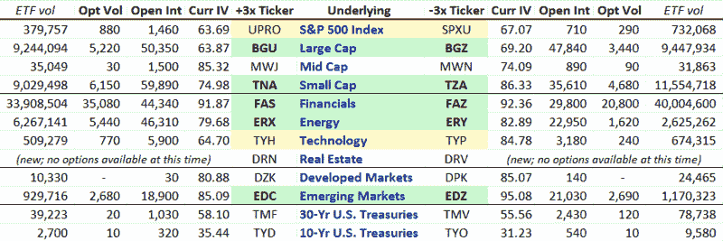

<!--yml

分类：未分类

日期：2024-05-18 17:37:47

-->

# VIX and More: Triple ETF Options Landscape

> 来源：[`vixandmore.blogspot.com/2009/07/triple-etf-options-landscape.html#0001-01-01`](http://vixandmore.blogspot.com/2009/07/triple-etf-options-landscape.html#0001-01-01)

由于我发现自己在[三倍 ETFs](http://vixandmore.blogspot.com/search/label/triple%20ETFs)的交易中变得越来越活跃，我认为读者可能会对市场上目前存在的三倍 ETFs 的一些重要期权数据图表感兴趣。

利用来自[iVolatility.com](http://www.ivolatility.com/options.j)的数据，下面的表格捕捉了 12 对三倍 ETFs 的平均期权成交量、持仓量和当前隐含波动率。我将 ETF 分成了四组：宽指数 ETF（市值关注）；行业 ETF；地理 ETF；以及债券 ETF。我还用绿色对流动性排名前五的对进行了颜色编码，另外两个对用黄色突出显示，我相信它们流动性足够，可以交易，尽管它们还没有“五大”的追随者。

我将避免额外评论，只是指出我相信从这个相对简单的图表中可以获取很多额外的信息。

对于相关文章，请参阅：[使用期权控制杠杆 ETF 的风险](http://vixandmore.blogspot.com/2009/05/using-options-to-control-risks-in.html)

*[source: iVolatility]*
