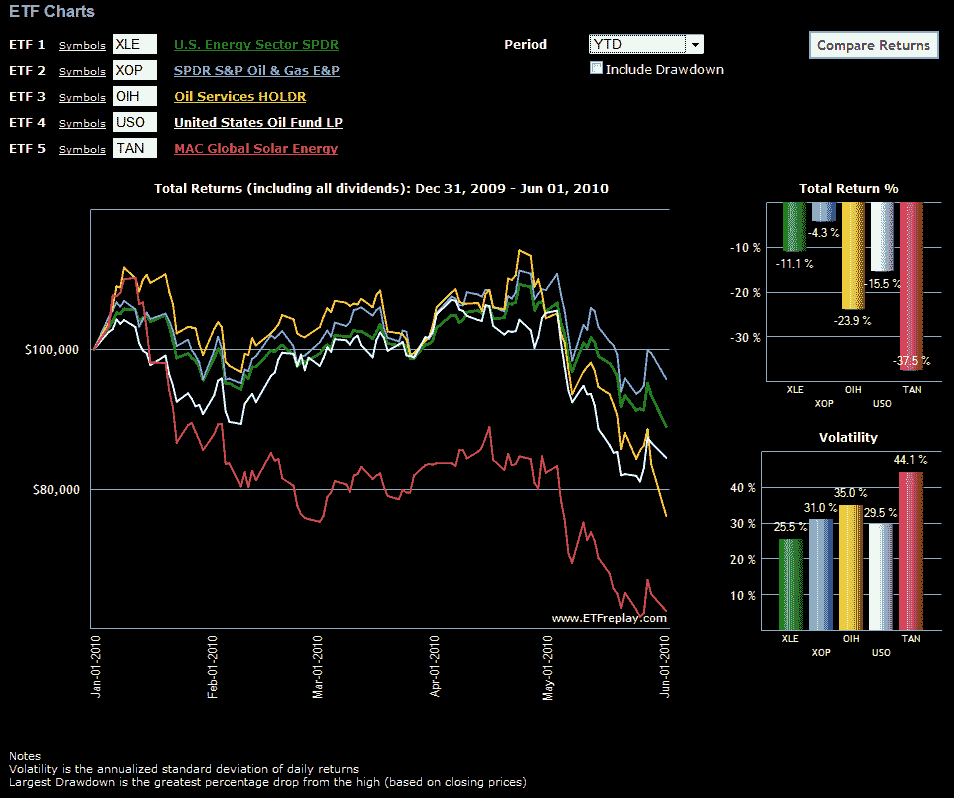

<!--yml

分类：未分类

date: 2024-05-18 17:09:10

-->

# VIX 和更多：石油行业的动荡

> 来源：[`vixandmore.blogspot.com/2010/06/turmoil-in-oil-patch.html#0001-01-01`](http://vixandmore.blogspot.com/2010/06/turmoil-in-oil-patch.html#0001-01-01)

几个因素结合在一起，在石油行业造成了动荡。最引人注目的是，深水地平线石油泄漏对 [BP](http://vixandmore.blogspot.com/search/label/BP) 和 Transocean 的([RIG](http://vixandmore.blogspot.com/search/label/RIG))股票造成了沉重打击，同时污染了整个石油和石油服务([OIH](http://vixandmore.blogspot.com/search/label/OIH), [XES](http://vixandmore.blogspot.com/search/label/OIH))部门。除了泄漏之外，欧洲主权债务危机引发了人们对欧洲地区及其以外经济放缓的担忧，而来自中国的制造业数据和其他消息暗示了未来能源需求最重要领域可能出现疲软。

简而言之，该行业的估值大幅下降，但长期供需失衡可能最多只会因为过去几个月的事件而受到小幅影响。

能源部门有着非常光明的前景，我在寻找在弱势时增加现有头寸的机会。如下图所示，有些迹象表明[原油](http://vixandmore.blogspot.com/search/label/crude%20oil) ([USO](http://vixandmore.blogspot.com/search/label/USO))可能已经触底，而勘探和生产 ETF ([XOP](http://vixandmore.blogspot.com/search/label/XOP))也可能开始了一个触底过程。除了化石燃料之外，在[太阳能](http://vixandmore.blogspot.com/search/label/solar%20stocks) ([TAN](http://vixandmore.blogspot.com/search/label/TAN), [KWT](http://vixandmore.blogspot.com/search/label/KWT))和风能([FAN](http://vixandmore.blogspot.com/search/label/FAN), [PWND](http://vixandmore.blogspot.com/search/label/PWND))领域的替代能源投资 somewhat suspect，因为像西班牙和德国这样的大型政府补贴似乎成为了主权债务危机的受害者。尽管如此，包括一些广泛的基础替代能源 ETF ([GEX](http://vixandmore.blogspot.com/search/label/GEX), [PBD](http://vixandmore.blogspot.com/search/label/PBD))在内的这些替代能源投资，也已经大幅降价，并且随着原油价格开始反弹，以及政府越来越受到使用环境可持续能源的压力，也应该会受益。

有关相关主题的更多信息，读者可以查阅：

*[source: ETFreplay.com]*

***披露(s):*** *在撰写本文时持有 OIH 和 XOP*
