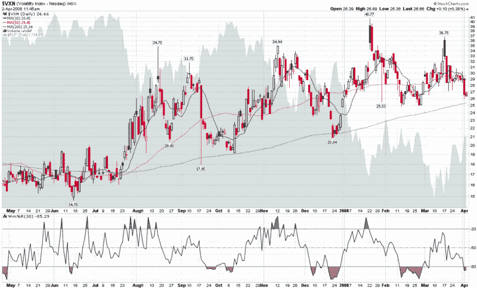

<!--yml

分类：未分类

日期：2024-05-18 18:39:24

-->

# VIX 和更多：转向 VXN…

> 来源：[`vixandmore.blogspot.com/2008/04/turning-to-vxn.html#0001-01-01`](http://vixandmore.blogspot.com/2008/04/turning-to-vxn.html#0001-01-01)

昨天，我展示了一张[VIX 与 VXV 的比率](http://vixandmore.blogspot.com/search/label/VIX%3AVXV)的图表，并提出了这种指标暗示的只不过是一种轻微的超买状态。

现在我们已经记录下了道琼斯工业平均指数上涨 400 点的 rally，似乎有很多评论员都在指出 VIX，并称市场超买。昨天我差点就说出研究 VIX 与 10 日简单移动平均线（SMA）的百分比偏差是解读 VIX 的“懒惰方法”，但事实是，我的观点基本就是这样（向所有陷入相同陷阱的女性表示歉意。）

是的，对于交易者来说，保持他们的一系列指标简单易管理是很重要的，但在这样做的同时，总是存在过度简化的风险。

回到 VIX，在我写下这些的时候，它又下跌了 0.18（0.8%），而 SPX 则上涨了 0.44%。我敢肯定这会让那些认为市场即将回调的 10%的人更加坚信不疑，但我并不准备接受这种解释。今天的 VIX:VXV 比率继续横盘整理，其他波动率指标——我承诺未来会给予更多关注——显示的是一个更倾向于区间震荡的模式，而不是 10%者们无疑在 VIX 中看到的暴跌波动率。

回想一下，金融股是标普 500 指数（SPX）中最大的组成部分，这意味着它们在波动率指数 VIX 中的权重最重（对标准普尔 100 指数，又名 OEX 以及其波动率对应指数 VXO 也是如此）。话说回来，既然已经解决了贝尔斯登([BSC](http://finance.google.com/finance?q=bsc))的问题，美联储已经扩大了其职能以增强投资银行的流动性，而雷曼兄弟([LEH](http://finance.google.com/finance?q=leh))在完成了 40 亿美元的可转换优先股发行后似乎已渡过难关，出现了强劲的需求([experiencing strong demand](http://www.bloomberg.com/apps/news?pid=20601087&sid=a014NhE6jEwU&refer=home))，与金融板块紧密相关的波动率自然显示出最急剧的下降。作为一个例子，最受关注的金融板块交易型开放式指数基金([XLF](http://finance.google.com/finance?q=xlf))自 3 月 17 日高点以来，波动率已经下降了 36%。同样地，波动率的下降使得 VIX 和 VXO 跌破了它们的 200 日简单移动平均线。然而，如果转向纳斯达克 100 指数的波动率指数[VXN](http://vixandmore.blogspot.com/search/label/VXN)，情况就没有那么戏剧性了。图表显示，自 2007 年 8 月以来，波动率一直在区间内波动，目前的读数仍然舒适地高于 200 日简单移动平均线，尽管有着更高的低点模式。考虑到金融板块在各个波动率指数中的相对权重，在我看来，VXN 跌破 25 的强劲突破将是波动率下降的比 VIX 和当前大多数情况更好的广泛基础迹象。

