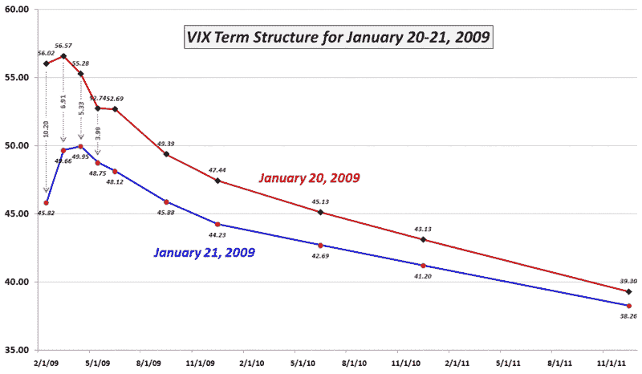

<!--yml

分类：未分类

日期：2024-05-18 18:04:18

-->

# VIX and More：VIX term structure 生活中的二十四小时

> 来源：[`vixandmore.blogspot.com/2009/01/twenty-four-hours-in-life-of-vix-term.html#0001-01-01`](http://vixandmore.blogspot.com/2009/01/twenty-four-hours-in-life-of-vix-term.html#0001-01-01)

我上次检查[VIX term structure](http://vixandmore.blogspot.com/2008/12/vix-term-structure-chances-since.html)时，我使用了图形来展示从 11 月 20 日的 VIX 峰值到更为平稳的 12 月 12 日值的[term structure](http://vixandmore.blogspot.com/search/label/term%20structure)的变化。结果是惊人的，显示了前一个月波动率下降了超过 31 点，而到 2010 年 6 月的 SPX 期权下降到了不到 3 点。

今天我想展示在短短 24 小时内可能发生的事情。当然，这不是您典型的 24 小时，它们是 VIX 首次记录连续 10.00 或更多点变化的时间：周二 VIX 上涨了 10.54；而昨天 VIX 下跌了 10.23 点。

昨天市场上涨导致的波动性错位再次将整个 term structure 向下推。在下图中，我突出了前四个月 term structure 的[隐含波动率](http://vixandmore.blogspot.com/search/label/implied%20volatility)的变化。二月份的一日变化为 10.20，几乎与现金/现货 VIX 的下降相同。望 3 月，隐含波动率下降了 6.91。四月份的下降是 5.33，而 5 月，IV 仅下降了 3.99。最小的变化出现在最遥远的月份，即 2011 年 12 月，隐含波动率仅下降了 1.04。

尽管过去 24 小时波动率预期已经降低，但请注意，截至年底的 SPX IV 仍在 44 左右，并且直到 2011 年中期都不会低于 40。根据期权交易员的观点，市场可能正在走出波动性，但这个过程将是漫长而缓慢的。

*[来源：CBOE，VIX and More]*
