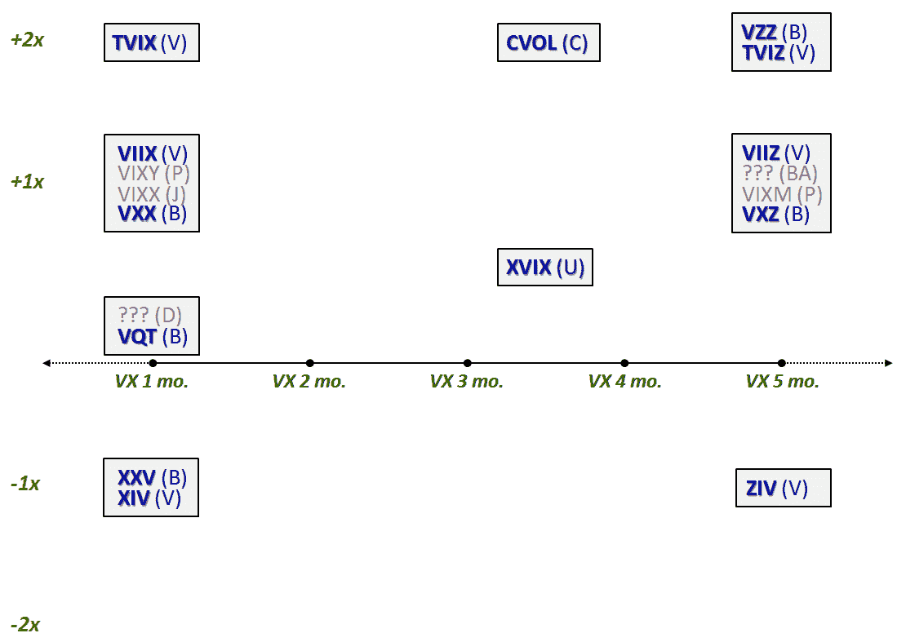

<!--yml

类别：未分类

日期：2024-05-18 16:57:24

-->

# VIX and More: 又有两款 VIX ETN，总共达到十三款

> 来源：[`vixandmore.blogspot.com/2010/12/two-more-vix-etns-makes-it-bakers-dozen.html#0001-01-01`](http://vixandmore.blogspot.com/2010/12/two-more-vix-etns-makes-it-bakers-dozen.html#0001-01-01)

除了昨天由 VelocityShares 推出的六款新的基于[VIX 的 ETN](http://vixandmore.blogspot.com/search/label/VIX%20ETN)，还有两款新的基于 VIX 的 ETN 昨天首次交易。

巴克莱将[VZZ](http://vixandmore.blogspot.com/search/label/VZZ)加入其产品系列，使得该领域中巴克莱产品的总数达到五款。VZZ 本质上是[VXZ](http://vixandmore.blogspot.com/search/label/VXZ)的+2 倍版本，目标到期时间为五个月。VZZ 是巴克莱推出的第一款杠杆波动率 ETN，有趣的是，缺少对应的+2 倍[VXX](http://vixandmore.blogspot.com/search/label/VXX)产品表明巴克莱并不认为有必要推出一个杠杆 VXX 的等效产品，或者可能是因为巴克莱发现杠杆和[VIX 期货](http://vixandmore.blogspot.com/search/label/VIX%20futures)期限结构前端的高升水的组合具有挑战性。

另外，瑞银通过一次巨大的举动进入了基于 VIX 的 ETN 市场。他们的新产品[XVIX](http://vixandmore.blogspot.com/search/label/XVIX)通过将标普 500 VIX 中期期货超额回报指数的 100%多头仓位与标普 500 VIX 短期期货超额回报指数的 50%空头仓位相结合，提高了创新力。换算成巴克莱的术语，这大致相当于长两个单位的 VXZ 和短一个单位的 VXX。根据 VIX 期货期限结构的形状，瑞银希望 XVIX 将受益于升水，并且还会因波动性增加而获得提振。未来 XVIX 的表现将特别引人关注。

我预计在投资者评估新的选择菜单时，波动性 ETP 领域的争夺战会暂时平息一下。与此同时，下面的图表应该会有所帮助。我已将那些已经宣布但尚未推出的产品变灰。

在这个过程中，最困难的部分可能是在学习过程中忘记罗马数字。不过我敢肯定，在某个交易大厅里，有些开玩笑的人正在大声喊着，“我多头 25 和 15，但空头 70。”

相关帖子：

***披露：*** *本文撰写时持有 VXX 的空头仓位*
