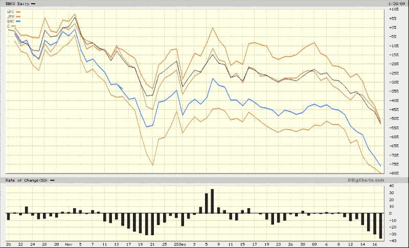

<!--yml

类别: 未分类

日期：2024-05-18 18:04:58

-->

# VIX 和更多：美国银行指数比 11 月更悲观

> 来源：[`vixandmore.blogspot.com/2009/01/us-banking-index-more-bearish-than.html#0001-01-01`](http://vixandmore.blogspot.com/2009/01/us-banking-index-more-bearish-than.html#0001-01-01)

随着全球各地对银行的压力不断增加，并且对欧洲银行（[RBS](http://vixandmore.blogspot.com/search/label/RBS)、[AIB](http://vixandmore.blogspot.com/search/label/AIB)、[BCS](http://vixandmore.blogspot.com/search/label/BCS)和[DB](http://vixandmore.blogspot.com/search/label/DB)）的打击尤其严重，美国银行业现在发现自己比 11 月的低点下降得更快。州立街银行公司（[STT](http://vixandmore.blogspot.com/search/label/STT)）一直被认为是美国最安全的银行之一，然而今天宣布，最近一个季度的利润下降了 71%，主要是由于该季度其投资组合中的[63 亿美元亏损](http://biz.yahoo.com/rb/090120/business_us_statestreet.html?.v=4)。

下图显示，银行指数（[BKX](http://vixandmore.blogspot.com/search/label/BKX)）的抛售比 11 月的任何时候都更加剧烈。尽管银行指数和大多数大型银行正在创造新低，但标普 500 指数设法[从其他行业获得动力](http://vixandmore.blogspot.com/2009/01/financials-account-for-half-of-loss-in.html)，保持在 11 月的低点以上，甚至高于上周的低点。

本周剩下的时间应该确定我们是否在更广泛的指数中有更高的低点（我猜）或者突破 SPX 800 挑战 11 月的低点。

*[来源: BigCharts]*
