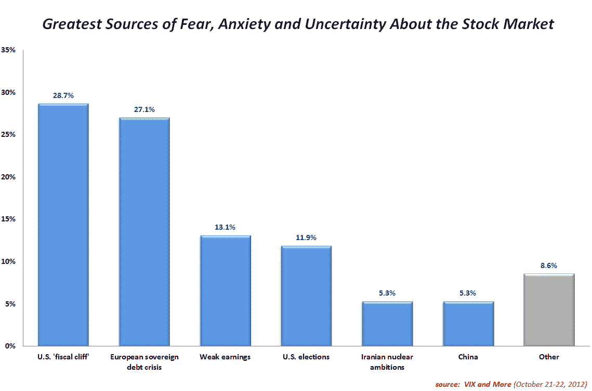

<!--yml

类别：未分类

日期：2024 年 5 月 18 日 16:24:30

-->

# VIX 和更多：美国财政悬崖问题成为首届 VIX 和更多恐惧投票的头号关注点

> 来源：[`vixandmore.blogspot.com/2012/10/us-fiscal-cliff-concerns-top-results-in.html#0001-01-01`](http://vixandmore.blogspot.com/2012/10/us-fiscal-cliff-concerns-top-results-in.html#0001-01-01)

今天，我结束了第一次*[VIX 和更多恐惧投票](http://vixandmore.blogspot.com/search/label/Fear%20poll)*，我认为这是一个毫无保留的成功，也是建立有关使投资者对股市的未来感到恐惧、焦虑和不确定的地缘政治、宏观经济、技术和其他问题的纵向数据的第一步。

在一场胶着战中，28.7%的投资者将[美国财政悬崖](http://vixandmore.blogspot.com/search/label/fiscal%20cliff)投票为他们目前的头号关注点，紧随其后的是对[欧洲主权债务危机](http://vixandmore.blogspot.com/search/label/European%20sovereign%20debt%20crisis)的担忧，被 27.1%的人标记为他们的头号问题。前景黯淡的收益季节排在第三位，占 13.1%。

*[来源：VIX 和更多]*

当 244 份回复根据地理位置进行分析时，出现了一些有趣的发现。例如，在美国，财政悬崖问题在欧洲主权债务危机之上占据主导地位，比例为 31.5%比 22.2%，而收益率较低排在第三位，占 15.4%。观察非美国的回复，美国中心主义的偏见消失了，因为 36.6%的受访者将欧洲主权债务危机视为他们最担心的问题，其次是财政悬崖（23.2%）和美国选举（9.8%）。

尽管有相当多的自由投票，但这些回复没有出现主题，尽管其中提到了央行干预、美国债务、去杠杆化、较高利率、高频交易、人口统计学和技术因素等问题。

在结果中引起一些问题的是，本地和国家媒体在塑造投资者恐惧方面的作用以及投资者过分强调最接近家门口的事件的倾向。这些只是我希望探讨的问题之一，利用一些随时间产生的投票数据，并将关注点的涨落与 VIX 的涨落进行比较。

展望未来，我预计每个周末都会进行一次 *VIX and More* 恐惧投票，结果和一些要点将在每周大约相同的时间发布。

相关文章：

***披露：*** *无*
