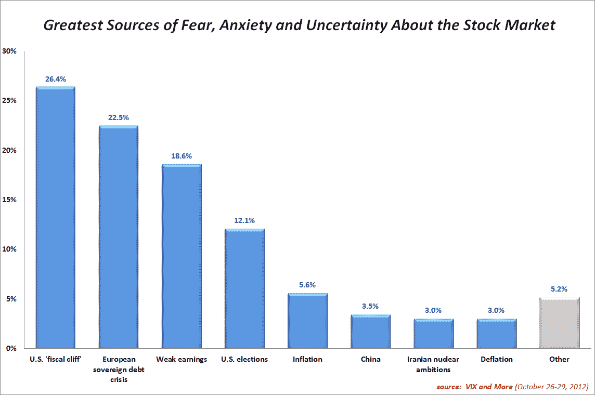
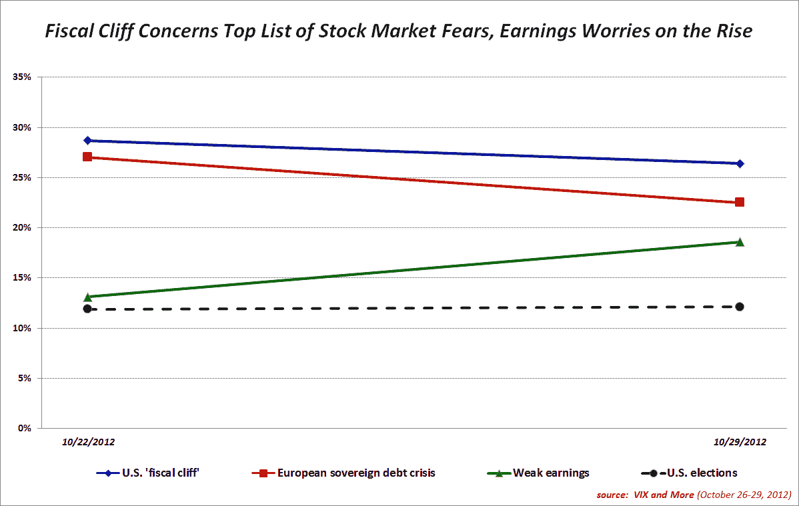

<!--yml

category: 未分类

date: 2024-05-18 16:24:20

-->

# VIX and More: U.S. Fiscal Cliff Fears Top VIX and More Fear Poll Again

> 来源：[`vixandmore.blogspot.com/2012/10/us-fiscal-cliff-fears-top-vix-and-more.html#0001-01-01`](http://vixandmore.blogspot.com/2012/10/us-fiscal-cliff-fears-top-vix-and-more.html#0001-01-01)

连续第二周，投资者将[美国财政悬崖](http://vixandmore.blogspot.com/search/label/fiscal%20cliff)列为股市最大的风险，紧随其后的是对[欧洲主权债务危机](http://vixandmore.blogspot.com/search/label/European%20sovereign%20debt%20crisis)的担忧。 上周第三位的对薄弱收益的担忧，在苹果（[AAPL](http://vixandmore.blogspot.com/search/label/AAPL)）和其他公司继续报告令人失望的收益和营收并降低未来预期的情况下，取得了显著进展。

与上周情况相同，地理位置似乎对结果产生了重大影响，美国受访者表现出明显的美国中心偏见。 例如，在美国，对财政悬崖的担忧超过了欧洲主权债务危机的 9.5％，但在美国之外，欧洲主权债务危机超过了对财政悬崖的担忧 8.2％。 同样，15.2％的美国受访者认为美国选举不确定性是股票的最大风险，而仅有 5.5％的非美国受访者认为美国选举是最重要的风险因素。

本周，我将通货膨胀和通货紧缩添加到了预设答案列表中。 两种反应都在关注列表中排名较低，但几乎有两倍的受访者表示对通货膨胀的担忧相对于通货紧缩。 虽然下面的图表显示了驱动股市恐慌的前四个问题的周变化情况，但可能还需要几个星期，这张图表才能提供有意义的见解。

再次出现了相当多的书面投票，但在书面回复中没有明显的主题。

由于飓风桑迪的原因，美国股市今天关闭，VIX 目前为 17.81，比一周前我发布[首次 VIX 和更多恐惧投票结果](http://vixandmore.blogspot.com/2012/10/us-fiscal-cliff-concerns-top-results-in.html)时高出 7.2％。

相关文章：

***Disclosure(s):*** *long VIX and short AAPL at time of writing*
