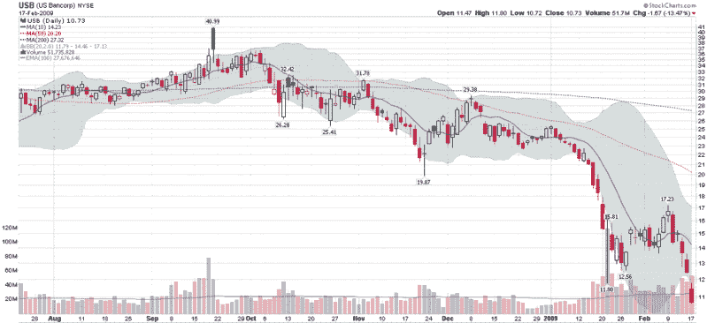

<!--yml

category: 未分类

date: 2024-05-18 17:59:21

-->

# VIX and More: 美国合众银行岌岌可危

> 来源：[`vixandmore.blogspot.com/2009/02/us-bancorp-reeling.html#0001-01-01`](http://vixandmore.blogspot.com/2009/02/us-bancorp-reeling.html#0001-01-01)

不久前，总部位于明尼阿波利斯的美国合众银行([USB](http://vixandmore.blogspot.com/search/label/USB))被认为是一个拥有强大贷款组合的“好银行”的典范。就在去年九月，该股票的交易价还高达 42 美元，该银行被广泛称赞为少数几家正在赶超劣质竞争对手的全国性银行之一。然而，就在 1 月 21 日，该银行宣布由于不良贷款组合和证券亏损而导致盈利下降了 65％，故事开始崩溃。

回顾过去一周银行股的表现，令我吃惊的是，在大型银行中，美国合众银行一直是表现最差的。下图显示了从 1 月 21 日开始的与收益相关的 52 周低点在昨天被果断突破，这是在一周内交易量巨大的情况下发生的，股票价值下跌了三分之一。

投资者们密切关注花旗集团([C](http://vixandmore.blogspot.com/search/label/C))和美国银行([BAC](http://vixandmore.blogspot.com/search/label/BAC))是否显示出疲软的迹象，或许美国合众银行以及[地区银行](http://vixandmore.blogspot.com/2009/02/regional-banks-in-trouble.html)才更好地反映了银行业发展的真实情况，而不是它们的准政府大哥们。

*[source: StockCharts]*
