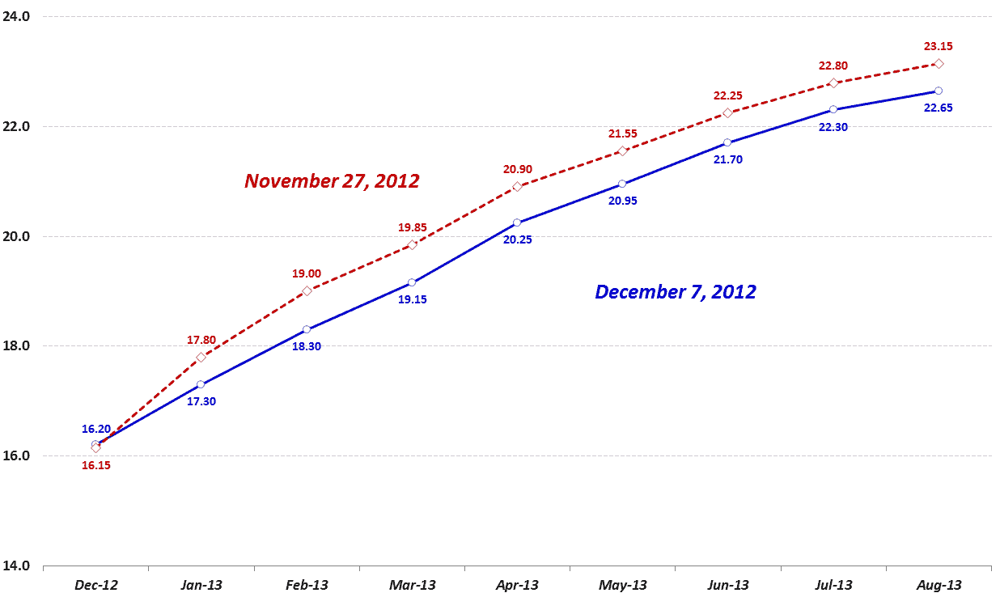

<!--yml

类别：未分类

日期：2024 年 05 月 18 日 16:21:39

-->

# VIX and More：最近 VIX 期货期限结构出现异常变化

> 来源：[`vixandmore.blogspot.com/2012/12/unusual-twist-in-vix-futures-term.html#0001-01-01`](http://vixandmore.blogspot.com/2012/12/unusual-twist-in-vix-futures-term.html#0001-01-01)

即使美国的 [财政悬崖](http://vixandmore.blogspot.com/search/label/fiscal%20cliff) 处于风口浪尖，使得 VIX 指数难以下跌到 15 以下，我仍然认为我可能能够推出我年度系列文章的一部分，讨论 [假日效应](http://vixandmore.blogspot.com/search/label/Holiday%20Effect)（或者 [历法回归](http://vixandmore.blogspot.com/search/label/calendar%20reversion)）：

事实证明，与假日季节因素相比，与财政悬崖相关的 [担忧](http://vixandmore.blogspot.com/search/label/fear) 已经占据主导地位，至少到目前为止，[VIX 期货](http://vixandmore.blogspot.com/search/label/VIX%20futures) [期限结构](http://vixandmore.blogspot.com/search/label/term%20structure) 已经以一种明显异常的方式扭曲和转变。

下图显示了从 11 月 27 日（虚线红线）到今天（实线蓝线）的 VIX 期货期限结构曲线，间隔了八个交易日。通常情况下，当期限结构发生变化时，最极端的变化发生在前期限（12 月）合约中，次大的变化发生在第二个月（1 月）合约中，依此类推，一直到后期限，后期限的变化通常只有前期限的三分之一左右。

使下图如此有趣的是，前期限合约略有上升（实际上上升了 0.05 点），而市场对未来隐含波动性的估计一直下降，一直到 8 月份至少下降了 2.2%（7 月和 8 月），最多下降了 3.8%（2 月）。我们对这些 VIX 期货变化可以得出什么结论呢？很可能投资者正在购买 12 月的保护（VIX 期货将于 12 月 19 日开盘到期），并且出售长期日期的 VIX 期货合约，以资助该保护的成本。总的来说，市场反映了 2013 年的风险降低，但在接下来的两周左右，由于稍微增加了未来两周风险和不确定性的风险，这种风险又有所抵消。

*[来源：芝加哥期货交易所（CFE）]*

相关文章：

***披露：*** *无*
