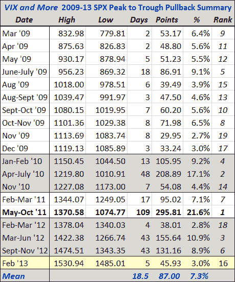

<!--yml

分类: 未分类

日期: 2024-05-18 16:18:24

-->

# VIX and More: SPX 1485 的更新回撤摘要表

> 来源：[`vixandmore.blogspot.com/2013/02/updated-spx-pullback-summary-table-for.html#0001-01-01`](http://vixandmore.blogspot.com/2013/02/updated-spx-pullback-summary-table-for.html#0001-01-01)

我收到了许多请求的图形之一是我 SPX 回调摘要表。这个表从 2009 年 3 月的 SPX 底部开始，跟踪了 SPX 各个新高点的所有有意义的峰谷回调。

上周的 SPX 1530.94 的新高和本周的抛售给了我更新该表的借口，我假设了今天早些时候的 SPX 低点 1485.01 暂时保持不变。使用这些数据，在下面的表中，19 次回调的平均持续时间为 19 天，平均回调为 7.3%。为了比较起见，中位数要低得多，为 7 天和 5.6%的回撤。

从这些平均值推断，一个平均回调会将 SPX 带回到 1420，而一个中位回调则建议将目标下调至 1446。当然，这些只是平均数；2011 年的 21.6%回调重复将把 SPX 恰好带回到 1200。

*[来源：Yahoo、VIX and More]*

相关文章:

***披露：*** *无*
