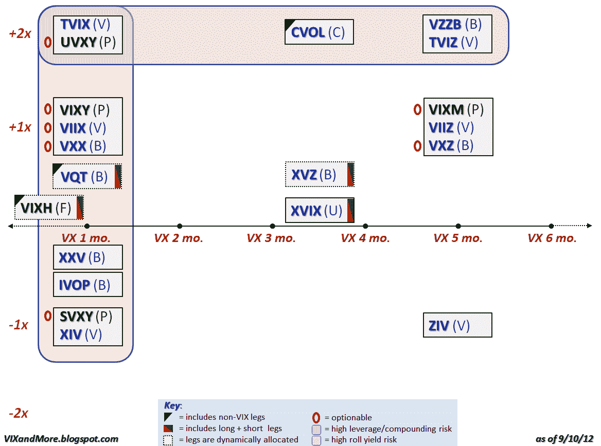

<!--yml

类别：未分类

日期：2024 年 5 月 18 日 16:25:14

-->

# VIX and More: VIX ETP 景观更新：增加 VIXH；关闭 12 个瑞银产品

> 来源：[`vixandmore.blogspot.com/2012/09/updates-to-vix-etp-landscape-add-vixh.html#0001-01-01`](http://vixandmore.blogspot.com/2012/09/updates-to-vix-etp-landscape-add-vixh.html#0001-01-01)

2012 年前两个三分之二的时间过去了，我们才看到第一个基于 VIX 的交易所交易产品，并且事实证明它是一个有趣的产品：[第一信托标普 500 尾部对冲基金 ETF](http://www.ftportfolios.com/Retail/Etf/EtfSummary.aspx?Ticker=VIXH)（[VIXH](http://vixandmore.blogspot.com/search/label/VIXH)），这是在八月底推出的。VIXH 基本上是一个由 SPY 的 99-100%组成的投资组合，通过 VIX 到期周期开始时的 VIX 水平来动态分配 0-1%的[VIX 期权](http://vixandmore.blogspot.com/search/label/VIX%20options)，期权的数量由 VIX 的水平决定。这是第一个在其持有资产中包括 VIX 期权的 VIX-based ETP，值得注意的是，该产品违反了最近的趋势，是 ETF 而不是 ETN。VIXH 还有其他值得讨论的特点，我将在未来的文章中讨论这些。

随着 VIX ETP 产品的扩张和收缩，瑞银决定关闭其 12 个 ETRACS ETNs，有效日期为 2012 年 9 月 11 日。这些瑞银产品未能获得足够的交易量和资产，无法在长期内实现可行性，但当[AAVX](http://vixandmore.blogspot.com/search/label/AAVX)退市时，它将拥有有史以来最佳的 VIX ETP 跟踪记录。该产品于 2011 年 9 月 8 日推出，自推出以来的一年多时间里上涨了约 120%。*[请参阅[ETRACS 波动率 ETPs](http://vixandmore.blogspot.com/2012/02/etracs-volatility-etps.html)来获取将关闭的 ETP 列表。]*

下图是我对[VIX 交易产品](http://vixandmore.blogspot.com/search/label/VIX%20ETN)(ETP)的定期更新，使用 y 轴表示杠杆，x 轴表示目标到期。除了底部键中的解释性注释外，值得注意的是我使用字体颜色来区分**ETFs**（黑色）和**ETNs**（蓝色）。此外，我使用括号中的字母代码来识别发行者：B = 巴克莱; C = 花旗银行; F = 第一信托; P = ProShares; U = 瑞银; V = VelocityShares。

*[另外，正常发布应在本周恢复...]* 

相关文章：

******

***披露：**撰写时长期持有 VIX*
