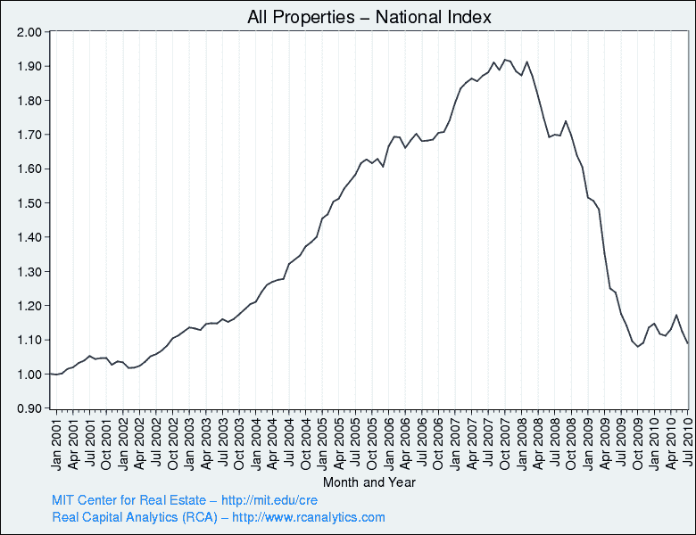

<!--yml

类别：未分类

日期：2024 年 05 月 18 日 17:01:57

-->

# VIX and More: 更新商业地产画面

> 来源：[`vixandmore.blogspot.com/2010/10/updating-commercial-real-estate-picture.html#0001-01-01`](http://vixandmore.blogspot.com/2010/10/updating-commercial-real-estate-picture.html#0001-01-01)

我对多少人通过谷歌和其他搜索引擎登陆到这个博客，以寻找关于[商业地产](http://vixandmore.blogspot.com/search/label/commercial%20real%20estate)各种问题的答案感到惊讶。我发现这很有趣，因为我只给 CRE 标签打了六篇文章（本文底部的链接），而在过去的 17 个月里没有打标签。显然，有很多人有问题，但很少有答案。

我在 2009 年 4 月涉及的 CRE 主题之一是[Moodys/REAL 商业地产价格指数](http://web.mit.edu/cre/research/credl/rca.html)。根据[麻省理工学院房地产中心](http://web.mit.edu/cre/)，CPPI“旨在跟踪同一属性实现的完整往返价格变化，仅基于已完成的、当代的财产交易中的记录价格。该指数不使用评估估值。”实际上，CPPI 中有许多指数和子指数。我在下面复制了月度全国指数，该指数聚合了来自四个主要物业类型部门（办公室、公寓、工业和零售）在广泛的都市地区的数据。子指数跟踪不同部门和不同地理位置的趋势。

请注意，在下面的全国指数图表中，从年初以来指数的反弹自 4 月份以来一直在逆转。查看部门（未显示），商业地产市场唯一持续强劲的领域是公寓。办公室部门的反弹微弱，工业部门似乎摇摆不定，而零售部门持续急剧下降。

未来，我打算在商业地产市场上发布更多帖子。

对于那些希望从业内人士那里获得更加定期的内容流的人，请查看我去年编写的我最喜欢的[商业地产博客](http://vixandmore.blogspot.com/2009/04/commercial-real-estate-blogs.html)的列表。

相关帖子：

*[来源：麻省理工学院房地产中心，真实资本分析]*

****披露：*** *无**
