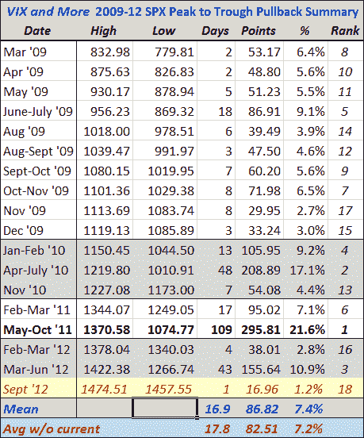

<!--yml

类别：未分类

日期：2024-05-18 16:25:03

-->

# VIX 和更多：更新 2009 年后的校正遗产

> 来源：[`vixandmore.blogspot.com/2012/09/updating-legacy-of-post-2009-corrections.html#0001-01-01`](http://vixandmore.blogspot.com/2012/09/updating-legacy-of-post-2009-corrections.html#0001-01-01)

在这个空间里我更新的所有周期性主题中，总是有一个让我惊讶的是一张我称之为 *VIX 和更多 2009-12 SPX 高峰到低谷回撤总结* 的表格 - 其当前版本如下所示。

这张表格是从 2009 年三月股市低点以来所有重要回撤的一种编年史。我稍微调整了回撤的定义，使其仅包括从新高点回撤。因此，自 SPX 于今年 9 月 6 日创下新高以来，就没有重要的回撤。话虽如此，我将最近两天的价格走势作为临时条目以红色标记在表格底部，截止到交易日结束前一刻的数据。一般来说，至少需要回撤 2.5% - 3.0% 才能被列入这张表格。

我怀疑投资者喜欢这张表格的主要原因是它为他们提供了市场最近是如何回撤的一些历史背景，从而有助于设定当前或随后校正的幅度预期。在当前小幅回撤之前，中位回撤为 5.6%，而平均回撤为 7.4%，多亏了几次更尖锐的校正。应用于上周五的 SPX 1474 高点，这些意味着回撤至 SPX 1392 或 SPX 1365。当然，这就是应该插入“过去表现不代表未来结果”类型的免责声明的地方，但历史参数可以帮助设定预期。

考虑到德拉吉和伯南克的支撑，以及中国可能出现硬着陆的概率和程度，欧元区命运的逆转，财政悬崖问题的恶化，各种地缘政治热点的爆发等等，也许预测目前市场走向会比平常更加困难和危险。

话虽如此，考虑到 SPX 在短短三个多月内上涨了 210 点，投资者在今年剩余时间内表现出比平时更多的谨慎，并无可责怪。

[另外，我喜欢专家们谈论 *校正* 的方式，好像暗示市场对最近的牛市行情判断错误，现在是冷静头脑和更合理估值发挥作用的时候。当然，当市场被卖空过度时也可能出现这种类型的“校正”，但是找到那些谈论股票向上校正的人会有点难。]

相关帖子：

******

***n 是一种常用的*无*
