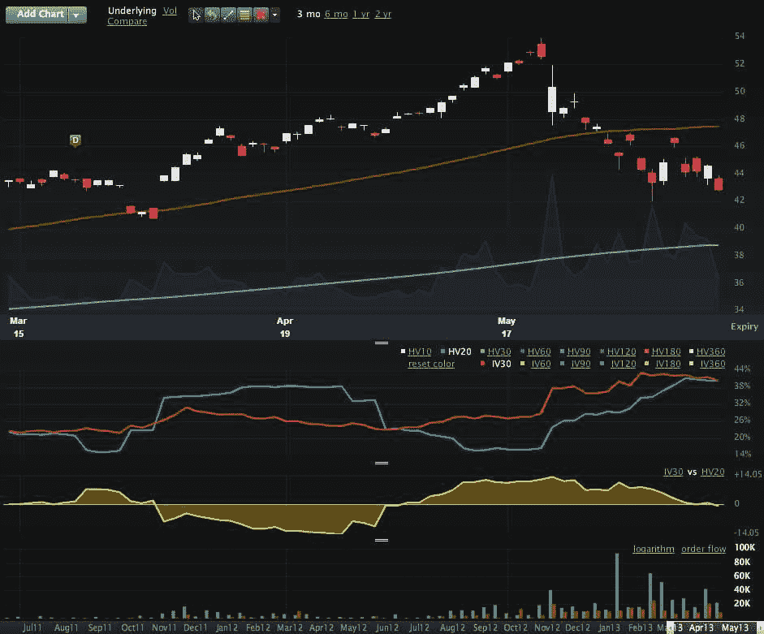

<!--yml

类别：未分类

日期：2024-05-18 16:15:56

-->

# VIX and More：利用 DXJ 监测日本股票、货币和风险的发展

> 来源：[`vixandmore.blogspot.com/2013/06/using-dxj-to-monitor-developments-in.html#0001-01-01`](http://vixandmore.blogspot.com/2013/06/using-dxj-to-monitor-developments-in.html#0001-01-01)

由于本周二的[货币套利、DBV 和风险](http://vixandmore.blogspot.com/2013/06/the-currency-carry-trade-dbv-and-risk.html)显然引起了许多投资者的共鸣，这些投资者正在努力理解日本正在发生的情况以及对美国股票和其他资产类别的影响，我想今天跟进一下，着重介绍一种重要的 ETP，可以用作指标或进行投机和套期保值：智石树日本套期保值股权基金（[DXJ](http://vixandmore.blogspot.com/search/label/DXJ)）。

如其名称所示，DXJ 旨在持有日本股票，通过货币套期保值，不受日本[日元](http://vixandmore.blogspot.com/search/label/Yen)波动的影响。正如 WisdomTree 所说：

“该基金采用旨在跟踪智石树日本套期保值股权指数的投资方法。该指数和基金旨在提供对日本股票的曝光，同时对美元和日元之间的波动进行套期保值。该指数和基金旨在跟踪仅归因于股票价格而不受货币波动影响的日本股票的股票证券的表现。”

虽然 DXJ 于 2006 年 6 月 16 日推出，但直到 2013 年 1 月 15 日才开始交易期权。期权的引入尤其值得注意，因为尽管 DXJ 的价格提供了日本股票净值的综合视图，不受货币波动影响，但人们也可以利用期权价格的隐含波动率数据来确定市场参与者对未来货币套期保值的日本股票的风险和不确定性的看法。下图显示了 DXJ 的三个月视图，30 天隐含波动率（红线）在过去五周一直高于 20 天历史波动率（蓝线），尽管这些数字本周已经趋于一致。不出所料，近来 DXJ 的期权交易量大幅增加，并且交易量中存在着多头偏向（看涨期权 = 绿色，看跌期权 = 红色）。然而，我觉得更有趣的是，DXJ 的隐含波动率似乎在 6 月 5 日达到了峰值。

当 USD/JSP 早些时候跌破 94，很明显，日元的波动性很大，而这种波动性被 DXJ 避开了。如果有人对在低点买入日本股票感兴趣，并且希望消除类似 [EWJ](http://vixandmore.blogspot.com/search/label/EWJ) 中的货币风险，那么 DXJ 是一个值得考虑的替代选择。

另一方面，如果有人对监测日本股票和货币走势感兴趣，并且/或者跟踪市场对风险和不确定性的评估（通过隐含波动性），那么 DXJ 当然也可以成为实现这些目的的有用工具。

*[来源：LivevolPro.com]*

相关帖子：

***披露：*** *撰写时持有 DXJ 多头；Livevol 是 VIXandMore 的广告商*
