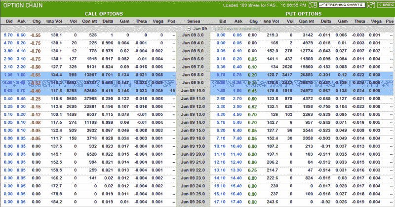

<!--yml

类别：未分类

日期：2024-05-18 17:45:36

-->

# VIX and More：使用期权控制杠杆 ETF 中的风险

> 来源：[`vixandmore.blogspot.com/2009/05/using-options-to-control-risks-in.html#0001-01-01`](http://vixandmore.blogspot.com/2009/05/using-options-to-control-risks-in.html#0001-01-01)

一些读者指出，对杠杆 ETF 的期权似乎是一场灾难，仿佛从杠杆中堆积杠杆不可能带来任何好处。虽然我完全理解这种观点，但这种思维方式典型地来自于对期权几乎没有或没有经验的投资者。对于不熟悉期权的投资者来说，期权世界通常似乎只限于偶尔的 covered call 或几乎和彩票券无异的虚值期权 - 看起来似乎同样频繁地支付。

事实上，大部分期权交易者之所以被期权吸引，是因为它们是定义、限制和管理[风险](http://vixandmore.blogspot.com/search/label/risk)的一种极好方式。是的，可以购买看跌期权为持有的股票提供保护，但是在没有持有基础资产的情况下（无论是股票、ETF、指数还是其他），期权交易者特别喜欢创建多腿期权头寸，其中下跌风险在交易开始时就已知，并且只要保持头寸，这种风险就不会改变。

获取回到杠杆 ETF，我已经在下表中复制了一部分[FAS](http://vixandmore.blogspot.com/search/label/FAS)的期权链，也许是[Direxion](http://vixandmore.blogspot.com/search/label/Direxion)三倍 ETF 中最臭名昭著的。当前的平均隐含波动率为 126，FAS 是一个高波动率的 ETF。FAS 如此波动，即使在 6 月期权仅剩 17 个交易日时，仍然可以卖出价值远离 70%的 6 月 15 日行权价期权，价格为 0.05。24.4%远离的 6 月 11 日行权价期权可以卖出价值为 0.40。

就风险管理而言，假设投资者认为 FAS 在接下来的 3 个半星期内不会上涨超过 24%，因此他/她决定卖出 6 月 11 日行权价期权，但通过以 0.15 的价格买入相同数量的 6 月 13 日行权价期权对这个头寸进行对冲。这是一个[空头呼叫价差](http://vixandmore.blogspot.com/search/label/bear%20call%20spread)，每个期权合约可以净赚 25 美元，最大损失为每个合约 175 美元（不包括佣金）。如果 FAS 到期时低于或等于 11.25 美元，该交易将赚钱，这意味着头寸可以吸收高达 27.2%的 FAS 上涨。这个交易提供 7-1 的赔率（175 美元对 25 美元），并且最大风险是定义明确的，无法在交易生命周期内改变。

这只是期权如何限制交易三倍 ETF 风险的一个例子。还有许多其他潜在的例子。

底线是，期权交易可以设计得比股票交易*更*不那么冒险，即使期权是在波动性证券上，比如三倍杠杆 ETF。

*[另外，读者可能已经注意到，到目前为止，我在选项工具和图形方面有点标准化，这些工具和图形都是通过 optionsXpress 提供的。未来，我会努力做得更好，突出一些其他期权经纪商提供的工具和内容，以展示给读者一些可用的内容，至少提供更多的视觉多样性。]*

** *[来源：OptionsHouse]*

***披露***：撰写时短持自己的 FAS。
