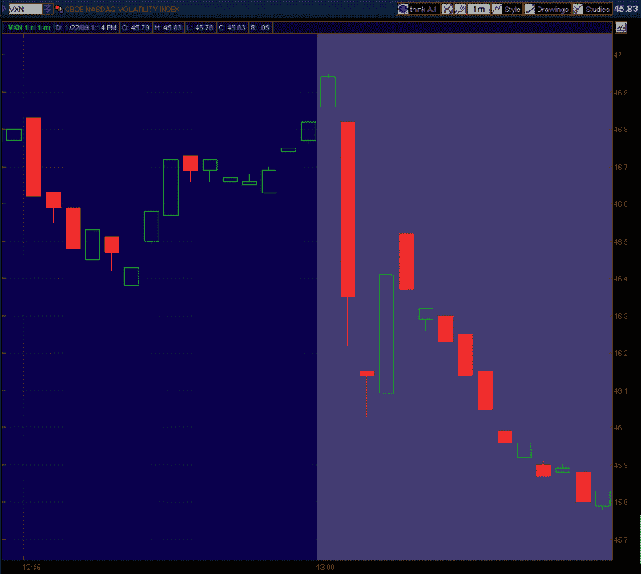

<!--yml

类别：未分类

日期：2024 年 05 月 18 日 18:04:07

-->

# VIX and More：VIX（和 VXN）的交易时间之后

> 来源：[`vixandmore.blogspot.com/2009/01/vix-and-vxn-after-hours.html#0001-01-01`](http://vixandmore.blogspot.com/2009/01/vix-and-vxn-after-hours.html#0001-01-01)

我最近收到一个关于 VIX 在收盘时大幅波动的问题。

在我回答这个问题之前，重要的是要记住指数期权的交易时间是东部时间上午 9:30 - 下午 4:15。

在我看来，关于 VIX 在晚间的波动问题涉及两个非常不同的时间范围：

+   正常股票交易日最后 15 分钟左右（东部时间下午 3:45 - 4:00）

+   在股票交易收盘后的 15 分钟内，股指产品仍在交易中（东部时间下午 4:00 - 4:15）。

首先看看早些时候的情况，在纽约证券交易所和纳斯达克证券交易所的正常交易的最后 15 分钟，经常会出现高交易量的程序化交易，其中包括或有时会触发大量的 SPX 期权交易。零售交易者往往很容易在交易数据中发现这些情况，并且这些情况通常与 SPX 的急剧波动一致。

股票市场收盘后的十五分钟更常与 VIX 出现异常大的波动有关。部分原因是市场收盘后宣布的大量新闻。当然，这些公告中包括了盈利报告，比如今天期待已久的来自谷歌的报告([GOOG](http://vixandmore.blogspot.com/search/label/GOOG))。

在东部时间下午 4:01，谷歌发布的公告显示，谷歌的收入和盈利均超过了分析师的预期，使得股价在 15 分钟的[黄昏时段](http://vixandmore.blogspot.com/search/label/twilight%20zone)内上涨了超过 2%，而此时股指交易仍然开放。

谷歌是[NDX](http://vixandmore.blogspot.com/search/label/NDX)（纳斯达克 100）的第二大组成部分，因此，看谷歌对波动率指数的影响最明显的地方是[VXN](http://vixandmore.blogspot.com/search/label/VXN)。下图由 thinkorswim 提供，显示了今天正常股票交易时间（使用我当地的太平洋时间戳）的最后 16 分钟以及股指交易时间结束时的 VXN 情况。图表显示，谷歌的正面消息有助于在纽约证券交易所和纳斯达克证券交易所正常交易结束后的 15 分钟内，VXN 下降了 0.99（2.1%）。如果谷歌超出分析师的预期幅度更大，或者出现重大失误，我不会对 VXN 在黄昏时段内波动 5-10%感到惊讶。

*[来源: thinkorswim]*
