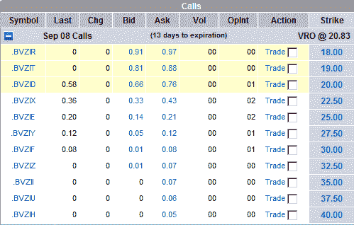

<!--yml

类别：未分类

日期：2024 年 05 月 18 日 18:28:19

-->

# VIX and More：VIX 二元期权

> 来源：[`vixandmore.blogspot.com/2008/09/vix-binary-options.html#0001-01-01`](http://vixandmore.blogspot.com/2008/09/vix-binary-options.html#0001-01-01)

7 月 1 日，芝加哥期权交易所推出了对 VIX 的[二元期权](http://en.wikipedia.org/wiki/Binary_option)。基本上，芝加哥期权交所的二元期权与早些年由 AMEX 推出的‘[固定回报期权](http://www.amex.com/?href=/options/prodInf/OptPiFROs.jsp)’相同。

正如名称所示，二元期权是一种一劳永逸的证券，如果标的物在到期时结算价达到或超过指定的行权价，将支付固定的现金结算金额。如果标的物在指定的行权价格以下结算，二元期权将毫无价值。如果您熟悉[Intrade.com](http://vixandmore.blogspot.com/search/label/Intrade)，那么您已经熟悉了二元期权。

至于 VIX 二元期权，这些都是欧式风格（不支持提前行权）的期权，目前只包括认购期权（没有认沽期权），并且以现金结算。芝加哥期权交易所规定如下的结算方式：

*“VIX 二元期权的行权结算值将与芝加哥期权交易所波动率指数期权的行权结算值（“VRO”）相同。VRO 是从用于在结算日计算指数的期权的开盘价格序列中计算的 VIX 的特殊开盘行情。任何没有交易的系列的开盘价格应为该期权的买价和卖价在交易开始时确定的平均值。行权将导致在到期后第一个工作日进行现金交割。

VIX 二元认购期权的行权金额将为 1）$100，如果 VRO 等于或大于 VIX 二元认购期权的行权价格；或 2）$0，如果 VRO 小于 VIX 二元认购期权的行权价格。”*

我与我最喜欢的两家期权经纪商，[thinkorswim](http://www.thinkorswim.com/)和[optionsXpress,](http://www.optionsxpress.com/)核实了 VIX 二元期权的可用性。thinkorswim 尚未实施 VIX 二元期权，但正在“努力增加”。optionsXpress 确实有 VIX 二元期权可供交易。要访问 optionsXpress 的 VIX 二元期权链，只需打开[VRO](http://vixandmore.blogspot.com/search/label/VRO)（VIX 特殊开盘行情表）的期权链。

下面是当前 optionsXpress VIX 二元期权链的图表。正如您所见，目前成交量和未平仓量都很少，导致买卖价差通常在 0.06 - 0.10 范围内。截至 8 月份，22,162 份 VIX 二元期权合约交易占所有 VIX 认购期权的 1.8%，占所有 VIX 期权交易的 1.1%。

要获取更多信息，请访问芝加哥期权交易所网站上的[VIX 二进制合约规格](http://www.cboe.com/products/indexopts/bvz_spec.aspx)。

[来源：optionsXpress]
