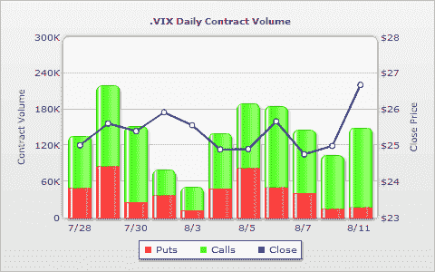

<!--yml

类别：未分类

日期：2024 年 05 月 18 日 17:34:22

-->

# VIX and More：VIX Calls Attract Attention

> 来源：[`vixandmore.blogspot.com/2009/08/vix-calls-attract-attention.html#0001-01-01`](http://vixandmore.blogspot.com/2009/08/vix-calls-attract-attention.html#0001-01-01)

我正在输入时，VIX 上涨约 7.4%，至 26.84，因为最近的涨势终于开始显示出衰退的迹象。

股市的疲软和 VIX 的上涨引发了对 VIX 认购的兴趣，九月 35 美元、九月 45 美元和八月 37.5 美元的认购吸引了大部分询价。

今天的交易尚未达到一半，VIX 的认购交易量处于较高水平，并且 VIX 认购与认沽的比率远高于最近的趋势，如 WhatsTrading.com 下面的图表所反映的那样。很难确定[VIX 期权](http://vixandmore.blogspot.com/search/label/VIX%20options)活动是否反映了新的投机活动或新的对冲活动，但我最好的猜测是，其中相当多的活动是投机性的。

注意，VIX 期权在明天到期一周后到期（请参阅[到期日历](http://www.theocc.com/publications/xcal/xcal2009.pdf)），最后交易日在今天后一周。

任何收盘超过 26.31 的情况都将标志着 VIX 一个月内的最高收盘价，但要将 VIX 带到比其[10 日移动平均线](http://vixandmore.blogspot.com/search/label/10%20day%20SMA)高 10%的水平，则需要将 VIX 的波动推高至 28.13。

*[来源：WhatsTrading.com]*
