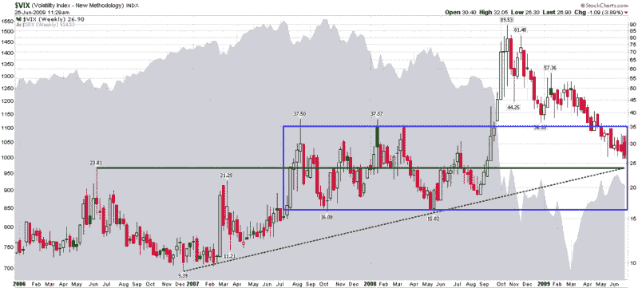

<!--yml

category: 未分类

date: 2024-05-18 17:41:12

-->

# VIX and More: 中 20 年代的 VIX 收敛区

> 来源：[`vixandmore.blogspot.com/2009/06/vix-convergence-zone-in-mid-20s.html#0001-01-01`](http://vixandmore.blogspot.com/2009/06/vix-convergence-zone-in-mid-20s.html#0001-01-01)

由于星期五经常是测试最近 VIX 低点的日子，我认为现在是放眼于典型 VIX 日线图并查看周线图的好时机。在下面的图表中，我选择回到 2006 年初，以捕捉当时可以说是有记录以来波动性最低的一年的细节，以便与我们见过的最波动的一年 2008 年进行比较。

虽然波动性最初在[2007 年 2 月](http://vixandmore.blogspot.com/search/label/February%2027)开始上升，但直到 2007 年 7 月，投资者才开始认识到，如果[次贷危机](http://vixandmore.blogspot.com/search/label/subprime%20mortgage)演变成全球金融传染病，可能会造成的损害程度。从 2007 年 7 月到 2008 年 9 月，波动率上升，但似乎受到图表中蓝色框所代表的 16-35 范围的控制。恰好这个范围的中点大致与水平绿线所代表的 2006 年 VIX 高点 23.81 相一致。

为了完整地呈现，我添加了一个连接 2006 年 12 月低点和 2008 年 5 月低点的虚线绿色趋势线。与蓝色框的 2006 年高点和中值一样，它的投影大约在 24-25 范围内。

这并不是说 VIX 不能低于 24-25，但考虑到周一标普 500 指数的下跌 3.06%和昨天的上涨 2.14%，目前的 26.65 水平在 VIX 似乎与最近的单日波动性不一致。

*[来源：StockCharts]*

***披露****：撰写时持有长期的 VIX 仓位。*
