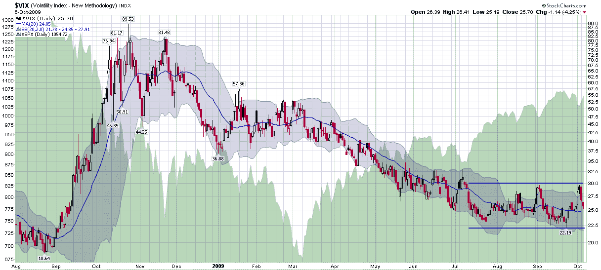

<!--yml

类别：未分类

日期：2024-05-18 17:27:20

-->

# VIX 和更多：VIX 定义了 22 到 30 之间的范围

> 来源：[`vixandmore.blogspot.com/2009/10/vix-defining-range-between-22-and-30.html#0001-01-01`](http://vixandmore.blogspot.com/2009/10/vix-defining-range-between-22-and-30.html#0001-01-01)

芝加哥期权交易所波动率指数（通常用其股票代码 VIX 表示）似乎已经舒适地稳定在 22.00 至 30.00 之间的范围内，这个范围自 7 月初以来一直在交易中。考虑到这个相对较窄的八个点的范围现在已经持续了三个月，自然会想知道 VIX 是否已经开始形成一个自然的顶部和底部，从而导致在这个范围内延长停留。

下面的图表跟踪了 VIX 自 2008 年 8 月以来的日常波动情况，并显示了作用在 VIX 上的引力如何将其从接近 90 降至 20 左右。这仍然高于 2008 年 8 月盛行的 19.00 至 22.50 的范围，但差距不大。

即使在围绕即将到来的盈利季节的所有不确定性中，-- 在明天的收盘后技术上由铝业公司（[AA](http://vixandmore.blogspot.com/search/label/VXX)）开启 -- 我仍然认为 VIX 在今年余下的时间里有很大可能会维持在过去三个月内的同一范围内。事实上，下周即将公布通用电气（[GE](http://vixandmore.blogspot.com/search/label/GE)）、美国银行（[BAC](http://vixandmore.blogspot.com/search/label/BAC)）、花旗集团（[C](http://vixandmore.blogspot.com/search/label/C)）、摩根大通（[JPM](http://vixandmore.blogspot.com/search/label/JPM)）、高盛（[GS](http://vixandmore.blogspot.com/search/label/GS)）、英特尔（[INTC](http://vixandmore.blogspot.com/search/label/INTC)）、国际商业机器公司（[IBM](http://vixandmore.blogspot.com/search/label/IBM)）、强生公司（[JNJ](http://vixandmore.blogspot.com/search/label/JNJ)）、[CSX](http://vixandmore.blogspot.com/search/label/CSX)等公司的盈利，我预计最多再过 2-3 周，今年余下时间的基调就会确立。

在季报发布前，由于波动性往往会加剧，有强烈的诱惑力去卖一些期权，包括 VIX 蝶式期权，在第三季度的结果开始涌入之前。很快我会有更多关于一些 VIX 蝶式期权交易想法的内容。

*[来源：StockCharts]*
