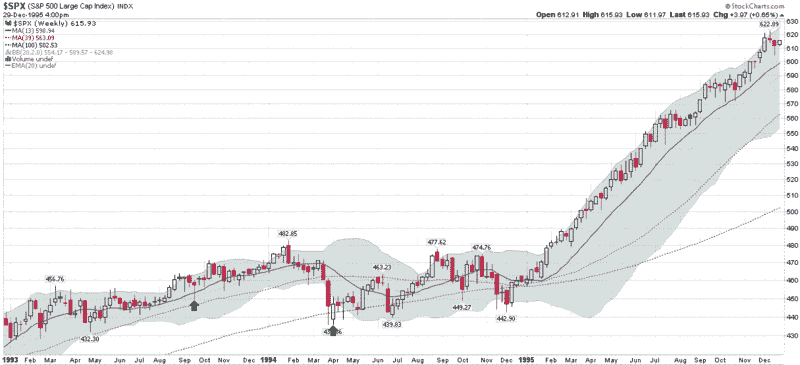
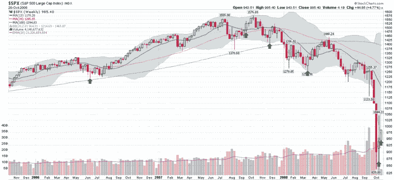

<!--yml

类别：未分类

日期：2024-05-18 18:19:53

-->

# VIX and More: VIX Drops 20% in One Day…Again

> 来源：[`vixandmore.blogspot.com/2008/10/vix-drops-20-in-one-dayagain.html#0001-01-01`](http://vixandmore.blogspot.com/2008/10/vix-drops-20-in-one-dayagain.html#0001-01-01)

有时，VIX 的大幅波动是显着的，有时则更难解释。从表面上看，昨天 VIX 下跌 24.7％ - 在百分比上是第二大的单日下跌 - 似乎属于后者。

从 1990 年到 2005 年，VIX 仅在两个交易日下跌了 20％：1993 年一次，另一次是在[1994 年](http://vixandmore.blogspot.com/search/label/1994)（请参见顶部图表中的绿色箭头）。 每个实例都标志着一个底部，大约持续三周的反弹。然后，市场在 1995 年大幅上涨，但可以说 VIX 并未提供关于至少九个月后的动向的任何信号。

经过 11 年的干旱，波动性的上涨使得在 2006 年中期[20％的下跌再次流行起来](http://vixandmore.blogspot.com/2008/10/yesterdays-vix-drop-is-fifth-largest.html)，包括昨天在内，过去两年零四个月已经出现了六次这样的情况。底部图表还用绿色箭头标记了这些 20％的下跌，这再次倾向于标志着大约三周左右的反弹。

一般来说，我不认为 VIX 单日下跌 20％特别显着。在大多数情况下，这仅仅是一个统计上的怪癖，是典型的均值回归过程的结果，该过程在波动性重返先前上涨[VIX 峰值](http://vixandmore.blogspot.com/search/label/VIX%20spikes)的路径时出现。在这种情况下，最初的 VIX 峰值是更值得关注的事件。

现在，轮到我最喜欢的短语之一了：“但这次不同！”

说实话，对于当前环境，我可以提出一个稍微不同的观点，即在 VIX 八周的高峰期，其峰值达到 81.17，是如此严重且持久，以至于重要的不是极端的[恐惧](http://vixandmore.blogspot.com/search/label/fear)，而是这种恐惧正在逐渐减轻。在这个国家的许多地方，人们在 75 年内从未如此恐惧过，因此，任何表明恐惧可能开始逆转方向的迹象确实是显著的。

让我们看看三周后的情况……

[来源：StockCharts]
