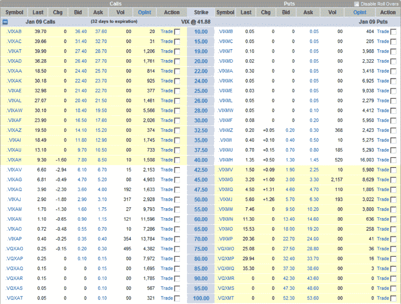

<!--yml

分类：未分类

日期：2024-05-18 18:10:01

-->

# [VIX 及更多](http://vixandmore.blogspot.com/search/label/VIX%20futures)：VIX 跌破 42；VIX 期权开始交易

> 来源：[`vixandmore.blogspot.com/2008/12/vix-drops-below-42-vix-calls-in-play.html#0001-01-01`](http://vixandmore.blogspot.com/2008/12/vix-drops-below-42-vix-calls-in-play.html#0001-01-01)

在过去几周内股市的区间交易活动给我们带来了自 10 月 3 日以来未见的事物：VIX 低于 42。

尽管 1 月和 2 月的[VIX 期货](http://vixandmore.blogspot.com/search/label/VIX%20futures)仍在 47-48 范围内交易，但普遍意见是 42 不可持续。事实上，支持这一观点的是最近几分钟内 1 月 70 和 75 的期权交易活动，因为投机者（也许还有对冲者）抓住了[VIX 期权](http://vixandmore.blogspot.com/search/label/VIX%20options)在圣诞节前的折扣价。

下图总结了 VIX 一月期权的交易情况，几乎所有 1 月 75 的期权交易都发生在我打字的时候。

*[来源: optionsXpress]*
