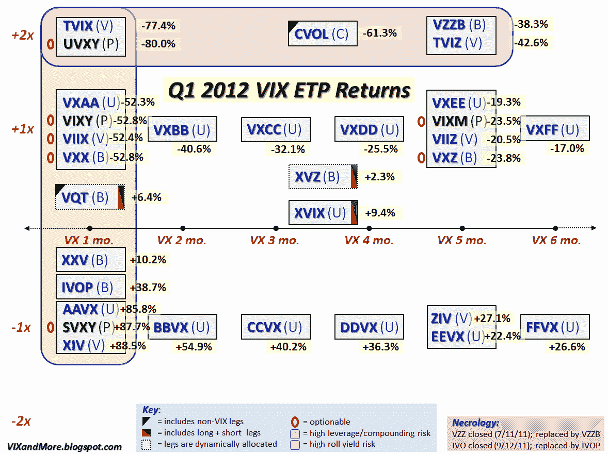

<!--yml

分类：未分类

日期：2024-05-18 16:33:48

-->

# VIX and More：2012 年第一季度 VIX ETP 回报

> 来源：[`vixandmore.blogspot.com/2012/04/vix-etp-returns-for-q1-2012.html#0001-01-01`](http://vixandmore.blogspot.com/2012/04/vix-etp-returns-for-q1-2012.html#0001-01-01)

在我咨询的日子里，我让自己相信，有些罕见的情况下，一个塞满数据的丑陋图表应该优先于一个简洁明了、侧重关键要点的简单图形。至少对于我的目的来说，下面的图表虽然不太可能会得到[信息美学](http://infosthetics.com/)或[流动数据](http://flowingdata.com/)等网站的赞誉，但却是其中之一，并且完美地满足了我的需求。*[毕竟，这个博客只是一个我归档自己古怪想法的地方，而两百万个闯入者只是一个好奇的副作用，但我偏题了……]*

回到主要内容，下图更新了[VIX 交易产品](http://vixandmore.blogspot.com/search/label/VIX%20ETN)（ETP）的格局（唯一的新增是两个新的红色 **0** ，表示[UVXY](http://vixandmore.blogspot.com/search/label/UVXY)和[SVXY](http://vixandmore.blogspot.com/search/label/SVXY)现在可选）并添加了 2012 年第一季度的表现数据。

当然，任何定期关注这个空间的人肯定已经意识到，第一季度全范围[VIX 期货](http://vixandmore.blogspot.com/search/label/VIX%20futures) [期限结构](http://vixandmore.blogspot.com/search/label/term%20structure)都出现了创纪录的[远月溢价](http://vixandmore.blogspot.com/search/label/contango)和负[滚动收益](http://vixandmore.blogspot.com/search/label/roll%20yield)。因此，长波动率产品经历了可怕的三个月，反向 ETP 积累了巨额收益，而那些具有动态配置（[VQT](http://vixandmore.blogspot.com/search/label/VQT)和[XVZ](http://vixandmore.blogspot.com/search/label/XVZ)）或对冲多头和空头波动率的产品（[XVIX](http://vixandmore.blogspot.com/search/label/XVIX)）则能够管理小(一些)的收益。

按照通常的模式，目标到期期限最短的产品最为波动，而目标到期期限较长的产品波动要小得多。

还要注意回报结构的对称性。对于所有被打击的多头产品（[TVIX](http://vixandmore.blogspot.com/search/label/TVIX)、UVXY、[VXX](http://vixandmore.blogspot.com/search/label/VXX)、[TVIZ](http://vixandmore.blogspot.com/search/label/TVIZ)等），都有相应的反向产品（[XIV](http://vixandmore.blogspot.com/search/label/XIV)、[SVXY](http://vixandmore.blogspot.com/search/label/SVXY)、[ZIV](http://vixandmore.blogspot.com/search/label/ZIV)等），它们的收益要比其多头波动率的损失大。

最后但并非最不重要的，也许收益的分布会有助于解释为什么我以这种方式组织了之前的 VIX ETP‘领域指南’。

这个图表应该隐含地提出了一系列问题，下面的链接是进一步探讨这些问题的良好起点。

目前，我会将额外的分析留给评论区的人士。

相关文章：

******

***披露：*** *长期持有 XIV、ZIV、BBVX 和 XVZ；在撰写时空头 TVIX、UXY 和 VXX*
