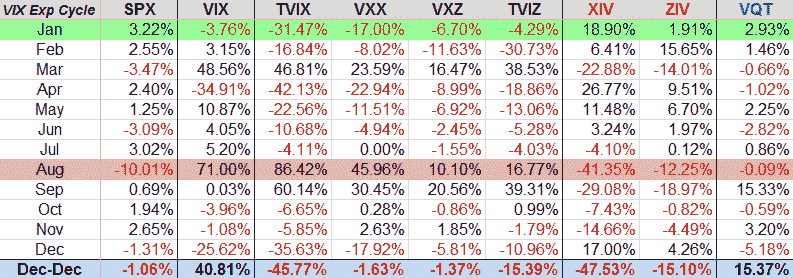

<!--yml

类别：未分类

date: 2024-05-18 16:45:22

-->

# VIX and More：VIX 交易所交易产品：2011 年回顾

> 来源：[`vixandmore.blogspot.com/2011/12/vix-exchange-traded-products-year-in.html#0001-01-01`](http://vixandmore.blogspot.com/2011/12/vix-exchange-traded-products-year-in.html#0001-01-01)

年尚未结束，但我可以大胆预测，当年结束时，将毫无疑问地认为 2011 年是[VIX 交易所交易产品](http://vixandmore.blogspot.com/search/label/VIX%20ETN)（ETPs）的牛市。在 2009 年推出两只 VIX ETPs 和 2010 年推出十只 VIX ETPs 之后，今年见证了 20 只 VIX ETPs 的推出。

下周我将提供一些关于 2011 年 VIX ETPs 演变和 2012 年展望的评论，但目前我想分享一张 2011 年全年 VIX ETPs 的性能表。

在我接下来解释下面的图表之前，我想先评论一下用于性能数据的时间段。现在或许我的生活太复杂了，因为我似乎不得不同时将其同步到三个不同的日历上：标准的[公历](http://en.wikipedia.org/wiki/Gregorian_calendar)，[期权到期日历](http://www.theocc.com/components/docs/about/publications/xcal2012.pdf)（特别是标准的每月和每周期权到期日）和[VIX 期权到期日历](http://www.theocc.com/components/docs/about/publications/xcal2012.pdf)（在上述链接中由紫色方块突出显示的星期三的 VIX 期权和期货到期日）。

在下面的图形中，我用绿色突出显示了 SPX 的表现最佳（VIX 到期周期）月份，并用红色突出显示了表现最差的月份。请注意，在整个年度（2010 年 12 月 22 日至 2011 年 12 月 20 日）期间，每个 VIX ETP（长波动率以绿色显示，短波动率以红色显示）都亏损了，尽管在该期间 VIX 上涨了超过 40%。唯一的例外是[VQT](http://vixandmore.blogspot.com/search/label/VQT)，它主要由一个 SPY 头寸组成，其中包括[VXX](http://vixandmore.blogspot.com/search/label/VXX)的动态分配，该分配占 ETP 持仓的 2.5%到 40%。*[有关 VQT 的更多信息，请参阅[为 VQT 辩护](http://vixandmore.blogspot.com/2010/10/case-for-vqt.html)和[巴克莱 VEQTOR ETN（VQT）开始交易](http://vixandmore.blogspot.com/2010/09/veqtor-etn-vqt-begins-trading.html)。]*

虽然有趣的是，长波动率 ETP 和短波动率 ETP 都未能在该年实现盈利，但在 2011 年期间，各种 VIX ETP 偶尔产生了非凡的收益。

如约，我将在年底及未来几周和几个月深入探讨 VIX ETPs 全球的表现及其作为投机和对冲的适用性。

相关帖子：

******

***披露：*** *写作时持有 XIV、ZIV 和 VQT 的多头头寸；持有 TVIX 和 VXX 的空头头寸*
