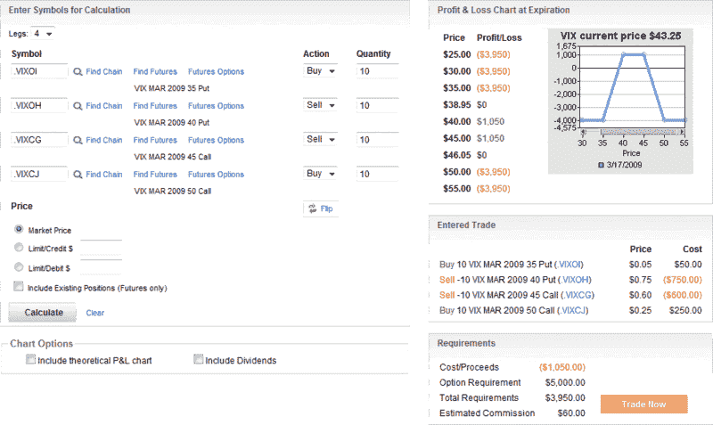

<!--yml

category: 未分类

date: 2024-05-18 17:55:22

-->

# VIX and More: VIX 到期凤头蝶式期权

> 来源：[`vixandmore.blogspot.com/2009/03/vix-expiration-condors.html#0001-01-01`](http://vixandmore.blogspot.com/2009/03/vix-expiration-condors.html#0001-01-01)

对于任何持有[VIX 期权](http://vixandmore.blogspot.com/search/label/VIX%20options)或打算在接下来的一两天交易 VIX 期权的人，提醒一下，VIX 三月期权的最后交易日是明天。VIX 期权在周三到期，[结算](http://vixandmore.blogspot.com/search/label/VIX%20SOQ)在周三早上 SPX 期权交易开盘时进行。对于尚未这样做的人，我建议将[OCC 期权到期日历](http://www.theocc.com/publications/xcal/xcal2009.pdf)加为书签，我已将其作为博客右侧栏的永久链接包含在其中。

随着 VIX [期权到期](http://vixandmore.blogspot.com/search/label/options%20expiration) 的临近，我想起了一个交易员，他喜欢在周一或周二做多铁[凤头蝶式期权](http://vixandmore.blogspot.com/search/label/condor)，打赌 VIX 在到期前相对平静。铁凤头蝶式期权交易与[A VIX 蝴蝶式交易](http://vixandmore.blogspot.com/2009/02/vix-butterfly-play.html)非常相似，上个月我描述过（另请参阅[A VIX 蝴蝶式交易的后续](http://vixandmore.blogspot.com/2009/02/follow-up-to-vix-butterfly-play.html)），唯一的区别是凤头蝶式期权的最大利润区间更宽，但最大上行空间更小。蝴蝶式和凤头蝶式期权还有一些其他实际区别，尤其是凤头蝶式期权不太可能需要后续的头寸调整和额外的佣金。也许与上述交易更相关的是，有时候可以让凤头蝶式期权交易延续到到期日，但对于蝴蝶式期权来说，这很少是一种理想的做法。

下面的图表概述了 VIX 铁凤头蝶式交易，使用了今天 optionsXpress 的数据。我把这些到期前交易称为“到期凤头蝶式交易”。

有关铁凤头蝶式期权和广泛的优质期权相关内容，建议访问[Condor Options](http://www.condoroptions.com/)。

*[来源: optionsXpress]*
