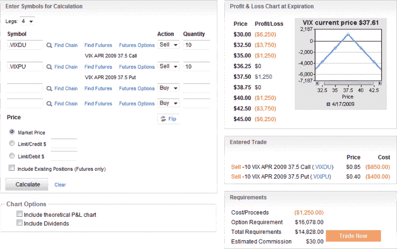

<!--yml

类别：未分类

日期：2024-05-18 17:51:58

-->

# VIX and More: VIX 到期跨式期权

> 来源：[`vixandmore.blogspot.com/2009/04/vix-expiration-straddles.html#0001-01-01`](http://vixandmore.blogspot.com/2009/04/vix-expiration-straddles.html#0001-01-01)

在今天的交易会话结束前不到一小时的时间里，4 月份的 [VIX 期权](http://vixandmore.blogspot.com/search/label/VIX%20options) 将不再交易，这似乎是提及一种纯粹的隔夜波动性投机的好时机：VIX 到期 [跨式期权](http://vixandmore.blogspot.com/search/label/straddle)。

我很难将这种交易称为其他而不是一种投机，我当然不建议这样做，但有些人喜欢这种类型的交易。

如下所示的 optionsXpress 图表所述，我在打字时 VIX 为 37.61，仅比 37.50 行权价高出 0.11。在图表中指示的示例中，卖出 10 份 4 月份 VIX 37.50 看涨期权和 10 份 4 月份 VIX 37.50 看跌期权可获得 1250 美元。如果 VIX 在明天开盘时以 37.50 结算，这就是最大的收益。正如盈亏表所示，盈亏平衡点为 36.25 和 38.75。亏损相当于最大利润的 1250 美元将在 35.00 和 40.00 实现。如果 VIX 结算价低于 35.00 或高于 40.00，那么亏损将更加显著。对于多头持仓来说，数字则相反。

这基本上就是这种交易的要点。

任何进行此交易的人都应该注意，明天开盘前将发布几个重要的经济数据，包括三月份的消费者价格指数数据、三月份的工业生产和产能利用率等。此外，在今天收盘后和明天开盘前，将公布一大批企业的季度收益。简而言之，隔夜可能发生很多事情。

然而……如果你认为 VIX 将在 36.25 和 38.75 之间稳定，那么 VIX 空头跨式期权是将这个想法付诸实践的一种方式。

还要记住，大多数寻求进行这种交易的期权交易者很可能会在到期前数周进行交易，并在最后交易日前平仓……但也有像隔夜方法一样的其他方法。

若要查看两个相关的 VIX 到期期权交易，请查看：

*[来源：optionsXpress]*
