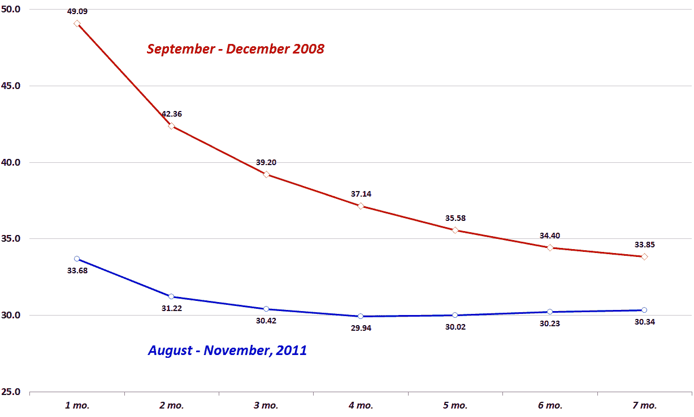

<!--yml

类别：未分类

日期：2024-05-18 16:47:45

-->

# VIX and More: VIX Futures: A Tale of Two Backwardations

> 来源：[`vixandmore.blogspot.com/2011/11/vix-futures-tale-of-two-backwardations.html#0001-01-01`](http://vixandmore.blogspot.com/2011/11/vix-futures-tale-of-two-backwardations.html#0001-01-01)

在昨天的[新 VIX 反向化记录](http://vixandmore.blogspot.com/2011/11/new-vix-backwardation-record.html)帖子之后，我想比较过去三个月的[VIX 期货](http://vixandmore.blogspot.com/search/label/VIX%20futures)[期限结构](http://vixandmore.blogspot.com/search/label/term%20structure)与之前记录的期限结构，该期限结构跨越了 2008 年 9 月至 12 月。

图示 VIX 期货随时间变化的机制相当复杂，因为不仅值每天都在变化，而且在任何一天可能会有多达十个期货合约交易，前七个月通常是唯一活跃交易的合约。当然，期货每个月都会滚动，因此结果是一系列滚动和滚动的数据。为了比较 2011 年的反向化记录数据和 2008 年之前的记录数据，我试图简化这个问题，得到了下图，显示了从第一个月、第二个月等到第七个月的 VIX 期货的平均值。请注意，2011 年的反向化相对较轻，与 2008 年的陡峭反向化相比。事实上，2011 年的曲线从第三个月到第七个月基本上是平的，而 2008 年的曲线则在整个期限结构上倾斜。

显然，2011 年与 2008 年期限结构形状的一些差异可以归因于 VIX 的绝对水平以及因此 2008 年的[均值回归](http://vixandmore.blogspot.com/search/label/mean%20reversion)预期比过去几个月高得多。

VIX 的学生可能会发现有趣的是，VIX 期货的前两个月在 2008 年 12 月中旬短暂地恢复了[正向化](http://vixandmore.blogspot.com/search/label/contango)，而此时 VIX 和前一个月的 VIX 期货仍然高于 55.00 水平。

事实证明，2008 年末的 VIX 期货大大高估了 2009 年上半年 VIX 的水平。看看同样的情况是否也适用于 2012 年上半年将会很有趣。

相关帖子：

**

*[来源：芝加哥期权交易所期货交易所，交互经纪人]*

***披露事项：*** *撰写时 VIX 短头寸*
