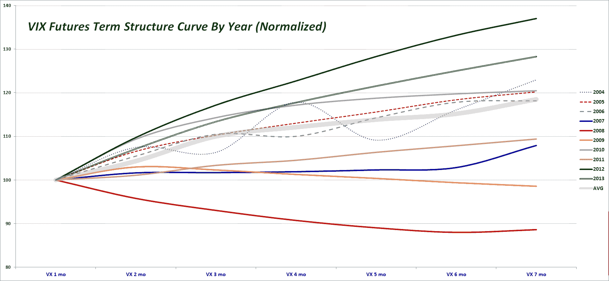

<!--yml

category: 未分类

date: 2024-05-18 16:12:09

-->

# VIX and More: VIX Futures Term Structure in 2013 Looks a Lot Like 2012

> 来源：[`vixandmore.blogspot.com/2013/12/vix-futures-term-structure-in-2013.html#0001-01-01`](http://vixandmore.blogspot.com/2013/12/vix-futures-term-structure-in-2013.html#0001-01-01)

This was a very quiet year for the VIX, with the volatility index posting its second narrowest range for the year since 1995, trailing only 2005, when the Greenspan liquidity flood overwhelmed even the mere thought of a meaningful correction.

The graphic below shows the average (mean) normalized [term structure](http://vixandmore.blogspot.com/search/label/term%20structure) for each year since the [VIX futures](http://vixandmore.blogspot.com/search/label/VIX%20futures) were launched, back in 2004\. In normalizing the data, I have set the average front month VIX futures contract to 100 and have expressed the averages of the second through seven months as multiples of the front month.

*[source(s): CBOE Futures Exchange (CFE)]*

Note that although the VIX futures were launched in 2004, consecutive VIX futures contracts for the first six months were not available until October 2006, hence the dotted lines for these years to reflect the erratic nature of the data. Interestingly, the lower VIX years of 2005 and 2006 did not produce the steep term structure that we saw in 2012 and saw again in 2013\. Last year I [described](http://vixandmore.blogspot.com/2012/10/the-2012-vix-futures-term-structure-as.html) the 2012 VIX futures term structure as a statistical outlier, but now that 2013 data is in the books, it may be more appropriate to think about how the markets might have changed in the last two years, with potential causes that range from the [VIX ETPs](http://vixandmore.blogspot.com/search/label/VIX%20ETN), more interest in trading volatility products, the rise of [weekly options](http://vixandmore.blogspot.com/search/label/weeklys) and other developments.

In the next few days I will devote a series of posts to analyzing some VIX, volatility and related data for 2013, then as 2014 unfolds I will offer some thoughts on how some of these markets are changing and evolving.

At the very least, I expect to ramp up my posting substantially in 2014, now that I have my investment management business up and running and find it easier to wear multiple hats at the same time.

Happy New Year!

Related posts:

***Disclosure(s):*** *none*
