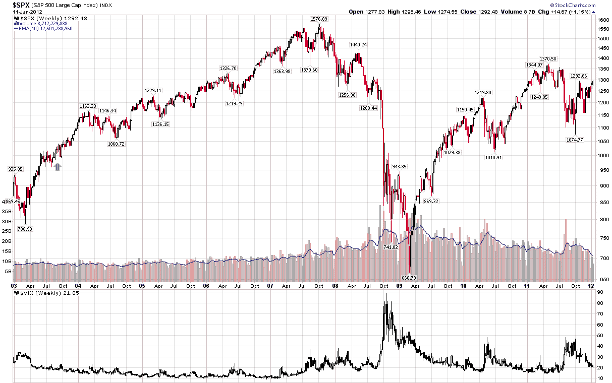

<!--yml

分类：未分类

日期：2024 年 5 月 18 日 16:43:46

-->

# VIX and More: VIX 创下史上最小的日内范围！

> 来源：[`vixandmore.blogspot.com/2012/01/vix-has-smallest-intraday-range-ever.html#0001-01-01`](http://vixandmore.blogspot.com/2012/01/vix-has-smallest-intraday-range-ever.html#0001-01-01)

如果说有哪一天要做空波动率的波动，那就是今天。事实上，今天创下了 VIX 日内范围最小（按百分比计算）的新记录，仅为 1.14%。

对于那些好奇的人（我知道你们在那里），先前的记录为 1.24%，日期为 2003 年 8 月 29 日。

下面的图表包括从 2003 年 1 月开始的每周柱状图和日期。它通过用绿色箭头标记以前的记录，将先前的小范围日放入上下文中。对于那些对历史先例更感兴趣的人，在旧记录后的一个月左右，VIX 从 18.63 缓慢上升到 22 左右，有一天短暂地触及 23。然后，当然，牛市的影响接管了，直到 2007 年，VIX 才达到 25。

*******

*[来源：StockCharts.com, CBOE, 雅虎]*

披露：

*无**
