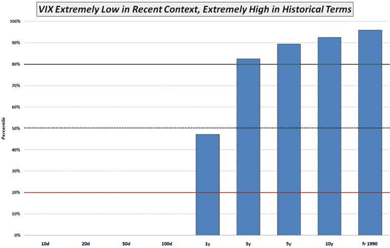

<!--yml

category: 未分类

date: 2024-05-18 17:52:08

-->

# VIX and More: VIX 高还是低？这取决于…

> 来源：[`vixandmore.blogspot.com/2009/04/vix-high-or-low-it-depends.html#0001-01-01`](http://vixandmore.blogspot.com/2009/04/vix-high-or-low-it-depends.html#0001-01-01)

有人问：周四收盘的 VIX 是 36.53，到底算高还是低，这在很大程度上取决于所用的历史背景来进行比较。

在下面的图表中，我将 36.53 表示为基于之前 10 天、20 天、50 天等的 VIX 读数的百分位数，一直回溯到 1990 年 1 月 VIX 历史数据的开始。该图表描绘了一个有趣的故事。由于 VIX 达到了 100 个交易日以来的最低水平，周四的收盘将其置于 0.0 百分位水平，包括在内的所有期间。

然而，如果将当前的 VIX 放在从 1990 年开始追溯的 20 年历史数据的背景下，那么 VIX 突然就处于 95.8 百分位数。正如图表所示，即使仅查看三年的历史数据，VIX 也处于 82.4 百分位水平。

最后，一年的数据表明，VIX 处于 47.4 百分位数，正处于其最近历史范围的中间位置。

所以...在历史上，根据回顾期，VIX 既极高又极低。对于短期交易，我发现 10 天和 20 天的数据最有用，有助于创建有利的[均值回归](http://vixandmore.blogspot.com/search/label/mean%20reversion)设定，尽管长期投资者可能应该将 VIX 相对于多年的历史视为未来波动方向的最相关指标。

*[来源：VIXandMore]*
