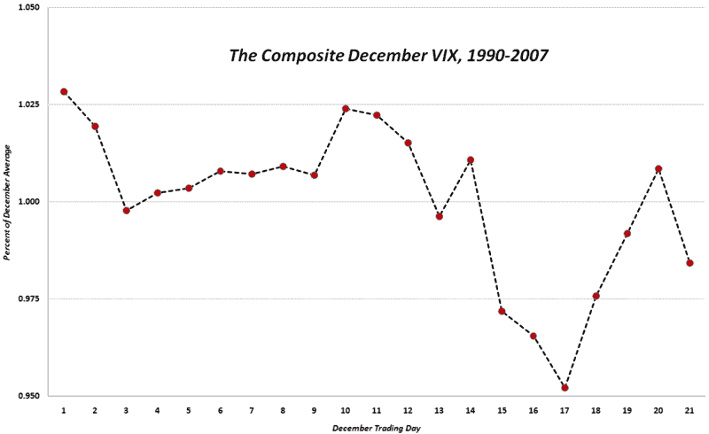

<!--yml

分类：未分类

日期：2024 年 05 月 18 日 18:09:29

-->

# VIX 与更多：VIX 假期“袭击”

> 来源：[`vixandmore.blogspot.com/2008/12/vix-holiday-crush.html#0001-01-01`](http://vixandmore.blogspot.com/2008/12/vix-holiday-crush.html#0001-01-01)

VIX 在 12 月份持续下降，从月初的高位 60 多下降到了我写这篇文章时的 42 附近。

显然，政府采取的向系统注入流动性的非凡措施已经部分地导致了波动性的收缩，但由于我经常谈论波动性的[假日效应](http://vixandmore.blogspot.com/search/label/Holiday%20Effect)并经常收到相关问题，我认为今天是分享我对这个主题的一些研究的好日子。

自 1990 年以来，十二月平均有 21.05 个交易日。下图捕捉了 1990 年至 2007 年间每个交易日的情况，以复合形式呈现，所有十二月份 VIX 值的平均值设置为 100。在图表中，从月中到圣诞节前，波动性的降低趋势最为明显，在这段期间，波动性从高于十二月平均值的 2.4%（第 10 个交易日）下降到低于十二月平均值的 4.8%（第 17 个交易日）。

记录一下，今天是十二月的第 17 个交易日，这使得十二月的波动率达到了历史低点。

我不至于说日历表明今天很可能是 VIX 在一段时间内下跌到 42 以下的最后一次，但那些对历史背景感兴趣的人可能希望在假日“[日历逆转](http://vixandmore.blogspot.com/search/label/calendar%20reversion)”效应消退时做好波动性增加的准备。

*[来源：VIX 与更多]*  
