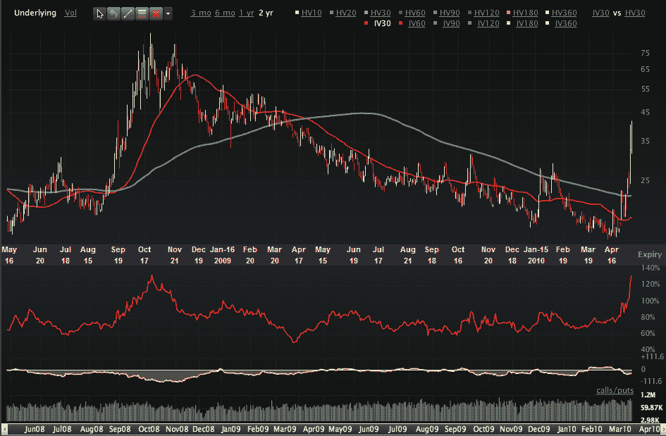

<!--yml

类别：未分类

日期：2024-05-18 17:10:49

-->

# VIX and More: VIX 隐含波动率超过 2008 年危机水平

> 来源：[`vixandmore.blogspot.com/2010/05/vix-implied-volatility-exceeds-2008.html#0001-01-01`](http://vixandmore.blogspot.com/2010/05/vix-implied-volatility-exceeds-2008.html#0001-01-01)

[VIX 期权](http://vixandmore.blogspot.com/search/label/VIX%20options)正在吸引如此多的关注，以至于 VIX 的[隐含波动率](http://vixandmore.blogspot.com/search/label/implied%20volatility)目前达到了 133，超过了 2008 年危机期间的高点 126。在这里明显的策略是卖出 VIX 看涨期权，通过做空看涨期权价差（[空头看涨期权价差](http://www.optionsxpress.com/educate/strategies/bearcallspread.aspx)）来限制风险。

有关相关主题的更多信息，请鼓励读者查看：

*[来源：Livevol Pro]*

***披露：*** *撰写时空头 VIX；ivevol 是 VIX and More 的广告商*
