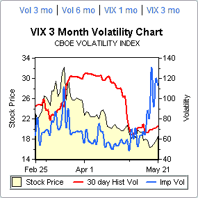

<!--yml

category: 未分类

date: 2024-05-18 18:35:43

-->

# VIX and More：VIX 隐含波动率激增

> 来源：[`vixandmore.blogspot.com/2008/05/vix-implied-volatility-surges.html#0001-01-01`](http://vixandmore.blogspot.com/2008/05/vix-implied-volatility-surges.html#0001-01-01)

这就是事情变得有趣的地方。VIX 是 SPX 期权的隐含波动率的衡量标准，但 VIX 本身也有其自身的隐含波动率，来自[VIX 期权](http://vixandmore.blogspot.com/search/label/VIX%20options)，我简称为 VIX IV。鉴于我们即将迎来一个漫长的周末（对于某些人来说），把 VIX IV 想象为标准普尔 500 指数的隐含波动率的隐含波动率吧。如果你愿意，也可以称之为[元波动性](http://vixandmore.blogspot.com/search/label/meta%20volatility)。

我提出这些心理体操的原因是，过去两周内，VIX 期权的隐含波动率显著增加。鉴于有不同的方法来计算跨多个行权价的隐含波动率总数，不同来源得出不同的总体 IV 值并不奇怪。就 VIX 而言，来自 optionsXpress（右上方）和 iVolatility.com（下方）的三个月期隐含波动率图表似乎得出非常相似的数字，VIX IV 从大约 50 上升到 115 左右。在 ISE 的情况下（最下方），他们的方法显示，VIX IV 在昨天达到了新的 52 周高点 230，并且今天围绕 198 左右。

我不确定为什么 ISE 与其他两个来源之间存在如此大的差异——当我得到一个合理的解释时，我会回来澄清这一点——但关键是，虽然 SPX 的隐含波动率开始缓慢回升，但 VIX 的波动性却在激增。这种现象有几种可能的解释，但无论哪种情况，VIX IV 的激增都表明期权交易员正在定价与近期 VIX 值相关的更高不确定性。一种可能的解释是：交易员们认为 VIX 显著上涨的概率正在增加。
