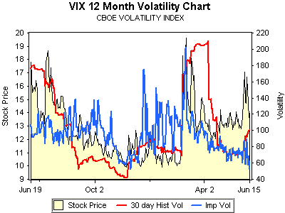

<!--yml

category: 未分类

日期：2024-05-18 19:09:57

-->

# VIX and More: **VIX 暗含波动率** 创下 52 周新低

> 来源：[`vixandmore.blogspot.com/2007/06/vix-implied-volatility-at-52-week-low.html#0001-01-01`](http://vixandmore.blogspot.com/2007/06/vix-implied-volatility-at-52-week-low.html#0001-01-01)

试图把太多信息塞进一个图形总是存在风险，但对于右边的图片，我觉得值得一试。

该图表由以下提供：

[optionsXpress](http://www.optionsxpress.com/)

，描绘了过去一年 VIX 期权中的隐含和历史波动率，以及 VIX 价格，这也是为什么它比（更优雅和可读性更强的）

[iVolatility](http://www.ivolatility.com/)

VIX

[期权图表](http://www.ivolatility.com/options.j?ticker=VIX:CBOE&R=1&period=12&chart=0&vct=4)

只显示了隐含波动率和历史波动率。

我提到这些的原因是，VIX 看涨期权昨日收盘的暗含波动率是过去 52 周中最低的。所以，如果你认为市场已经到了顶部，但又不愿意做空 VIX，因为它与个位数仍有相当距离，那么请考虑一下，VIX 看涨期权的波动率溢价是很长一段时间以来最便宜的。
