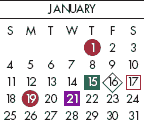

<!--yml

类别：未分类

日期：2024-05-18 18:05:37

-->

# VIX and More：VIX 一月期权作为短期投资组合保护

> 来源：[`vixandmore.blogspot.com/2009/01/vix-january-options-as-short-term.html#0001-01-01`](http://vixandmore.blogspot.com/2009/01/vix-january-options-as-short-term.html#0001-01-01)

我知道很少有零售交易者会积极交易[VIX 期权](http://vixandmore.blogspot.com/search/label/VIX%20options)，但对于那些通常不考虑这种产品的人来说，我想强调这样一个事实，即由于[VIX 到期日历](http://www.theocc.com/publications/xcal/xcal2009.pdf)与标准第三个星期五的月份股票和指数到期日历不同，这个周末可能是考虑将 VIX 期权作为短期投资组合保护工具的适当时机。

拥有明天到期的期权作为投资组合保险的任何人都可能对长周末会发生什么感到担忧，尤其是在有关花旗集团（[C](http://vixandmore.blogspot.com/search/label/C)）和美国银行（[BAC](http://vixandmore.blogspot.com/search/label/BAC)）被国有化的传言。当然，一个解决方案是将这些一月份的期权滚动到二月份及以后。然而，如果你不一定想为整整一个月购买投资组合保护，那么你可以通过一月份的 VIX 期权在周三早上获得它。一月份 VIX 期权的最后交易日期是 1 月 20 日（星期二），期权在周三早上开盘时结算。

股票期货已经上涨了一夜，但短期风险仍然存在，所有关于金融业的不确定性，再加上一个三天的周末，接着是奥巴马的就职典礼，星期二就要举行。我不敢大胆建议购买 VIX 期权，但我确实希望确保短期视角的投资者知道 VIX 期权到期日历的异常。

*[图形：Options Industry Council]*
