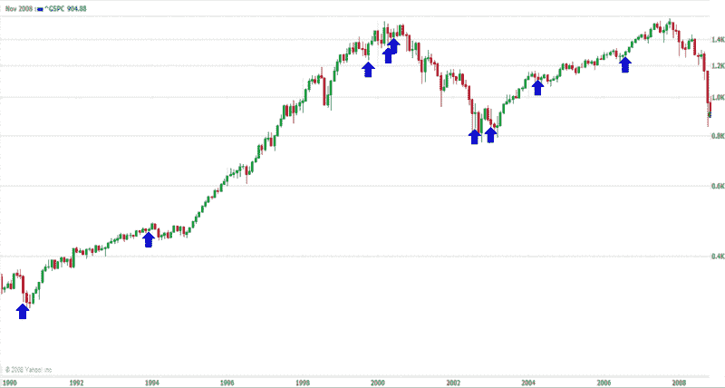

<!--yml

category: 未分类

date: 2024-05-18 18:17:13

-->

# VIX 和更多：VIX 连续两天上涨 10%

> 来源：[`vixandmore.blogspot.com/2008/11/vix-jumps-10-on-consecutive-days.html#0001-01-01`](http://vixandmore.blogspot.com/2008/11/vix-jumps-10-on-consecutive-days.html#0001-01-01)

在世界大部分地区，昨天的重大新闻是标普 500 指数连续第二天下跌 5%。在这里，我也注意到 VIX（波动率指数）连续第二天上涨了 10%，这已经是第九次发生了，回溯到 1990 年。

从市场定时的角度来看，VIX 连续两位数上涨的历史确实显示出明显的看涨倾向，但这种倾向直到第一天之后才会出现。在下面的图表中，我还将这九次双跳跃放入了历史背景中，并用蓝色箭头标记了它们，这些双跳跃的日子确实倾向于出现在重要的拐点，但这些拐点未必是趋势反转的信号，也不一定与牛市相关联。总的来说，然而，我认为这种双跳跃的 VIX 活动是一个看涨的发展趋势。

[source: 雅虎]
