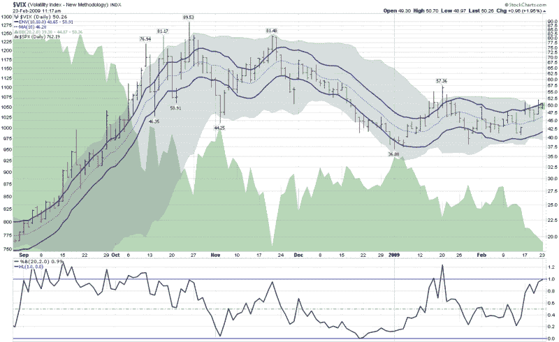

<!--yml

category: 未分类

date: 2024-05-18 17:58:23

-->

# [VIX 和更多](http://vixandmore.blogspot.com/2009/02/vix-kitchen-sink-chart.html#0001-01-01)：VIX 厨房水槽图表

> 来源：[`vixandmore.blogspot.com/2009/02/vix-kitchen-sink-chart.html#0001-01-01`](http://vixandmore.blogspot.com/2009/02/vix-kitchen-sink-chart.html#0001-01-01)

我在撰写此文时，VIX 再次超过 50，技术分析爱好者正在猜测 VIX 的下一个阻力水平在哪里，以及这是否会增加预测市场底部的几率。

下图是一种综合图表，包括 VIX 的 10 天移动平均线（虚线蓝线），周围是 10% 的[移动平均线信封](http://vixandmore.blogspot.com/search/label/moving%20average%20envelopes)（实线蓝线），以指示当 VIX 在该 10 天移动平均线上下 10% 时。

图表还包括[布林带](http://vixandmore.blogspot.com/search/label/Bollinger%20bands)（围绕价格历史的灰色云），这些布林带的默认设置保持在 20 天、2.0 标准偏差。我还添加了布林带的 [%b](http://vixandmore.blogspot.com/search/label/%25b) 设置，以确定 VIX 相对于布林带范围中间（0.5）的位置。

在高度波动的时期，布林带通常比移动平均线信封宽得多，而 VIX 的大幅变动通常会在达到布林带极限之前穿透移动平均线信封。然而，目前，布林带的上界为 50.36，移动平均线信封的顶部为 50.91。到目前为止，VIX 的日内高点为 50.70，布林带已被突破，但移动平均线信封仍然完好。这种不寻常的情况反映了我们目前经历的相对低[历史波动率](http://vixandmore.blogspot.com/search/label/historical%20volatility)（SPX 的 20 天历史波动率低于 35，SPX 的 50 天历史波动率是自 9 月以来最低）。

如果考虑到[隐含波动率](http://vixandmore.blogspot.com/search/label/implied%20volatility)主要是历史波动率加上基于[恐惧](http://vixandmore.blogspot.com/search/label/fear)和不确定性的溢价，则显然，目前恐惧和不确定性成分导致隐含波动率（以 VIX 的形式）几乎比历史波动率高出了 50%。

*[来源：StockCharts.com]*
