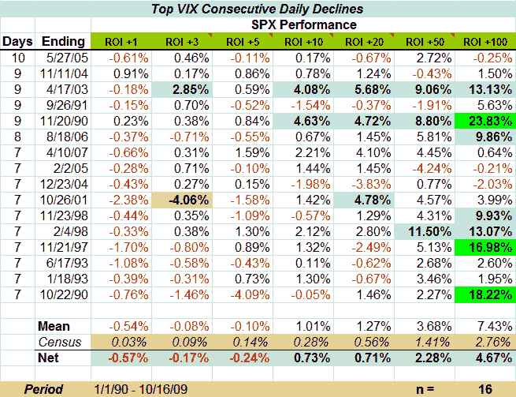

<!--yml

分类：未分类

日期：2024-05-18 17:25:57

-->

# VIX 和更多：VIX 几乎创造了新的连续下降记录

> 来源：[`vixandmore.blogspot.com/2009/10/vix-narrowly-misses-new-consecutive-day.html#0001-01-01`](http://vixandmore.blogspot.com/2009/10/vix-narrowly-misses-new-consecutive-day.html#0001-01-01)

在连续下跌了创纪录的十天之后，VIX 在今天以 0.37 的涨幅在美东时间下午 4:00 - 4:15 的 [暮色区](http://vixandmore.blogspot.com/search/label/twilight%20zone) 交易时段内几乎创造了新的记录，收盘价为 21.49，+0.06。

在下面的图表中，我从[订阅者通讯](http://vixandmoresubscriber.blogspot.com/)中借用了一些数据，以帮助将当前的下降置于适当的历史背景中。在上周五结束的连续下降之前，VIX 连续下降十天的唯一其他时间是在 2005 年 4 月至 5 月。那时，牛市刚刚开始暂停一个月，直到六个月后，牛市才开始重新断言自己。

查看 VIX 连续下跌至少七天的其他十五个情况时，一个模式显现出来，即在 VIX 连续下跌之后，标普 500 指数往往会在一周左右出现轻微下跌，然后在接下来的时期内显着超出历史平均水平（“人口普查”），从 10 到 100 个交易日。

在添加解释性叙述方面，可以将 VIX 连续下降七天或更多天视为市场重新调整波动率预期的信号，并为在风险降低环境中进一步推进的道路铺平。当然，警告是，大约一周的均值回归（即，VIX 增加而 SPX 下降）通常作为从 VIX 下降到持续时间较长的股票市场回报高于平均水平的过渡期。

有关相关帖子，请鼓励读者查看[连续走势](http://vixandmore.blogspot.com/2007/03/streaking.html)——*VIX 和更多*的经典帖子，也是官方[轻松一刻](http://vixandmore.blogspot.com/search/label/lighter%20side)的选择。

