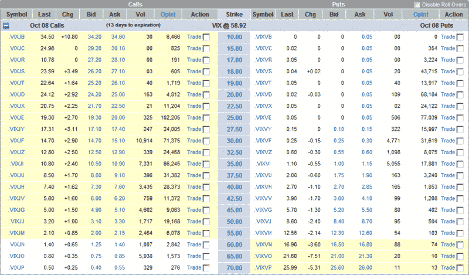

<!--yml

分类：未分类

日期：2024 年 05 月 18 日 18:22:54

-->

# VIX and More：VIX 十月 70 期权最近成交价为 $0.50

> 来源：[`vixandmore.blogspot.com/2008/10/vix-october-75-calls-last-traded-at-050.html#0001-01-01`](http://vixandmore.blogspot.com/2008/10/vix-october-75-calls-last-traded-at-050.html#0001-01-01)

下面我附上了一个 VIX 十月期权的快照，由 optionsXpress 提供，就在 VIX 创下 58.92 的新历史高点时。这个表格中有一些惊人的数字，我在这里为了档案目的进行记录。

[来源：StockCharts]
