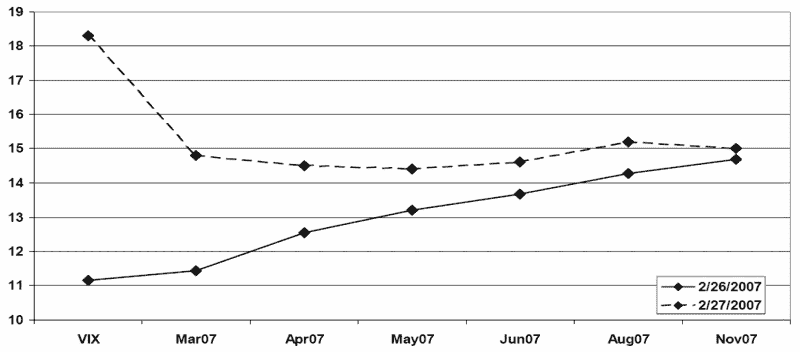

<!--yml

分类：未分类

日期：2024-05-18 18:36:23

-->

# VIX and More: 当前下降波动性环境中的 VIX 期权

> 来源：[`vixandmore.blogspot.com/2008/05/vix-options-in-current-declining.html#0001-01-01`](http://vixandmore.blogspot.com/2008/05/vix-options-in-current-declining.html#0001-01-01)

向今天的[快速交易 VIX 入门](http://adamsoptions.blogspot.com/2008/05/quick-trading-vix-primer.html)致敬，亚当在每日期权报告中提供了简洁的解释，解释了[VIX 期权](http://vixandmore.blogspot.com/search/label/VIX%20options)价格的基础-其中一些最近几天让休闲期权交易者摸不着头脑。

亚当的话：

*“VIX 估计未来 30 天的 SPX 本身的波动性。*

**VIX 期货是对期货到期日估计的赌注。 换句话说，它是市场对未来 30 天期货到期后波动率的预期快照。 例如，如果是 9 月期货，您在猜测市场如何定价从 9 月到期后的 30 天内的波动率。 您并不是在打赌现在到 9 月之间的 SPX 波动率; 这是一个常见的误解。”*

两张图可能有助于说明这一点。 第一张图最初出现在一年前的*VIX and More*中，[VIX Futures: The One Picture to Remember](http://vixandmore.blogspot.com/2007/05/vix-futures-one-picture-to-remember.html)并显示了发生在[VIX](http://vixandmore.blogspot.com/search/label/February%2027)的纪录性 64%暴涨之前一天和当天的[VIX 期货](http://vixandmore.blogspot.com/search/label/VIX%20futures)。 结论是，波动性的长期展望没有发生明显变化，但 VIX 期货从[正常](http://en.wikipedia.org/wiki/Contango)（随时间上升）变为[逆向](http://en.wikipedia.org/wiki/Backwardation)（随时间下降）。 因此，未来看起来仍然一样，但预计 VIX 将采取不同的路径到达基本上相同的位置。

第二张图是今天早上 VIX 期权的快照。请注意，随着（现金/现货）VIX 为 17.24，在 5 月 17.00 看跌期权（0.15）的买价几乎与 5 月 22.50 看涨期权（0.10）的买价相同。原因？[均值回归](http://vixandmore.blogspot.com/search/label/mean%20reversion)被定价到 VIX 期货中-并且期权反映了共识观点，即在接下来的一周内，VIX 上涨 5 点和 VIX 下跌 0.25 点的可能性几乎相同（请记住，[VIX 期权于星期三到期](http://www.theocc.com/publications/xcal/xcal2008.pdf); 本月是从今天起一周后）。
