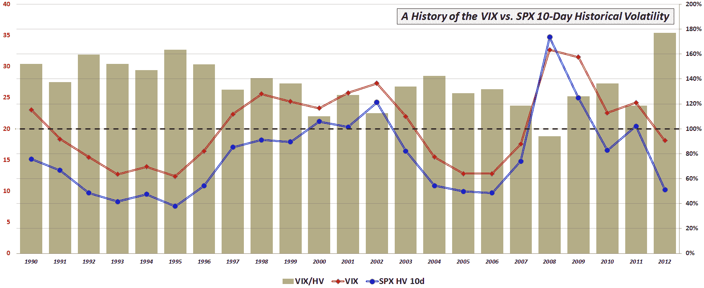

<!--yml

分类：未分类

日期：2024-05-18 16:33:37

-->

# 恒河水和更多内容：第一季度恒河水溢价达到历史最高水平

> 来源：[`vixandmore.blogspot.com/2012/04/vix-premium-to-spx-historical.html#0001-01-01`](http://vixandmore.blogspot.com/2012/04/vix-premium-to-spx-historical.html#0001-01-01)

2010 年 9 月，在[恒河水和历史波动率回到正常范围](http://vixandmore.blogspot.com/2010/09/vix-and-historical-volatility-settling.html)中，我提出了下面的图表的早期版本，以解释尽管当时的抗议，但恒河水和[历史波动率](http://vixandmore.blogspot.com/search/label/historical%20volatility)(又名[实现波动率](http://vixandmore.blogspot.com/search/label/realized%20volatility))之间的关系实际上符合历史正常水平。

这种说法不适用于 2012 年。

事实上，尽管恒河水对许多人来说很低，但在 2012 年的头三个月里，恒河水一直在追踪标普 500 指数的 10 日历史波动率的 177%。这个比率远高于长期平均水平 129%，也高于单年记录 - 1995 年的 162% - 那是在恒河水在标普 500 指数的实现波动性之上（“[波动性风险溢价](http://vixandmore.blogspot.com/search/label/volatility%20risk%20premium)”）的溢价通常远高于近年来的水平时发生的。

请稍作思考，从 1 月 27 日到 3 月 7 日，标准普尔 500 指数的 10 日历史波动率从未超过 10.00。如果恒河水的波动性风险溢价处于典型的历史水平 129%，那么整个时期恒河水将低于 13.00。当然，在这六周的时间里，恒河水从未低于 13.00。相反，投资者不愿接受如此低的恒河水（即，降低标普 500 指数期权价格），尽管实现波动性较低，这也是为什么在第一季度波动性风险溢价创纪录高位的部分原因（也许还有[灾难印记](http://vixandmore.blogspot.com/search/label/disaster%20imprinting)和相关问题）。

未来，人们可以合理地期望，实现的波动性将增加，或者恒河水将继续下降，以使波动性风险溢价接近历史水平 - 更有可能的是，未来将结合两种情景的元素。

现在我在这里打开了另一个潘多拉魔盒，预计将会有更多关于波动性风险溢价的跟进。

相关帖子：

**

*[来源：芝加哥期权交易所，雅虎]*

***披露：*** *无*
